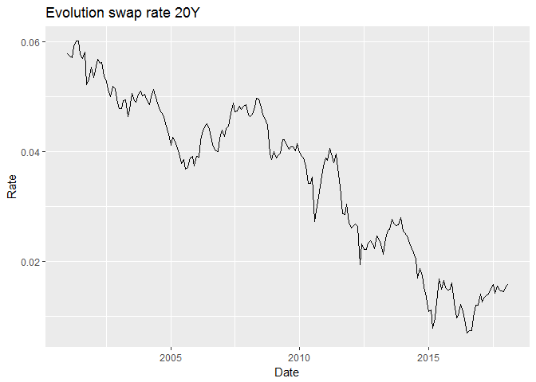
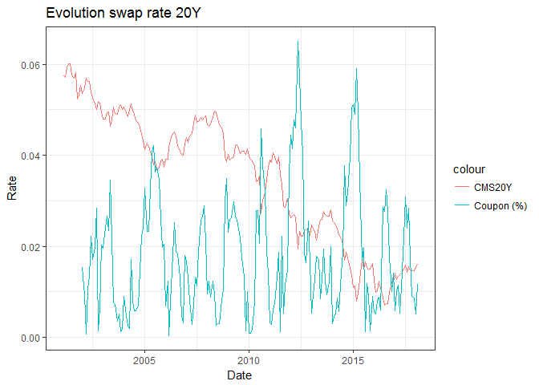

# VolBond
Pieter Pijls  
6 April 2018  

In this study we investigate the historical performance of a Vol-Bond. 

1. First we investigate the return when we start investing in January 2001 in a Vol-Bond with maturity of 15 years.
2. We investigate the results when we take into accont the shout option. We use the option to lock in the coupon rate when he is above 3%.
3. We study the return of the Vol-Bond for different starting dates. 


# Import Data

First, I import the swap rate curves from 2002 to 2018.


```r
# Import Data (swap rates)
setwd("C:/PIETER/INTERNSHIP P&V/Volbond")
rates <- read.xlsx("./EURIBOR vanilla interest rate swap contract.xlsx",colNames=TRUE,sheet=1)
# create date object
rates$DATE   <- seq(as.Date("2001/1/1"), by = "month", length.out = 206)

rates20 <- as.data.frame(cbind(seq(as.Date("2001/1/1"), by = "month", length.out = 206), rates$`20`))
rates20$V1 <- as.Date(rates20$V1)
```

We plot the evolution of the swap rate of 20Y because the Vol-Bond coupons will be based on this rate. 


```r
# plot evolution swap rate 20y
g <- ggplot(rates20, aes(x=rates20$V1,y=rates20$V2)) + geom_line() + ggtitle("Evolution swap rate 20Y") +
           xlab("Date") + ylab("Rate")

g
```

<!-- -->

# Volbond data

We import data for the Volbond. The first column is the date, the second is the CMS rate 20Y in advance. The third column corresponds with the CMS 20Y rate in Arrears. The final column is the coupon which is equal to 3.5*absolute_value(CMS20Y in Advance - CMS20Y in Arrears).

1. An interest rate swap in which the floating rate is set **in advance**, rather than in arrears. That is, the floating rate is **reset at the beginning of the previous period** except for the first period where the floating rate is set at the beginning of the corresponding period as in LIBOR-in-arrears swap. That implies that the floating rate periods, except the first one, are **shifted back by one period**. 

2. An interest rate swap in which the floating rate is set **in arrears**. This means, the floating rate is determined based on the value or level of a specific reference rate at the **end of the reset period**. Once defined, the rate is applied backwardly or retroactively to that period.


```r
# Import data for the Volbond
volbond20 <- rates <- read.xlsx("./Volbond20Y.xlsx",colNames=TRUE,sheet=1) 
volbond20$DATE <- seq(as.Date("2001/1/1"), by = "month", length.out = 206)
volbond20 <- volbond20[-1,]
tail(volbond20)
```

```
##           DATE   Advanced    Arrears      Coupon
## 201 2017-09-01 0.01552997 0.01419720 0.028423968
## 202 2017-10-01 0.01484673 0.01552997 0.017451072
## 203 2017-11-01 0.01469873 0.01484673 0.008950262
## 204 2017-12-01 0.01458644 0.01469873 0.008632111
## 205 2018-01-01 0.01555128 0.01458644 0.005047491
## 206 2018-02-01 0.01605061 0.01555128 0.011644508
```

We plot the evolution of the CMS rate 20y and the Volbond coupon. We observer that the coupon rate spikes when the CMS20Y rate is more volatile. This graph corresponds exactly with the one in Citi Group prospectus. 


```r
g <- ggplot(volbond20, aes(x=volbond20$DATE)) + geom_line(aes(y=volbond20$Advanced, colour = "CMS20Y")) + geom_line(aes(y=volbond20$Coupon, colour = "Coupon (%)")) + ggtitle("Evolution swap rate 20Y") +
           xlab("Date") + ylab("Rate") + theme_bw()
g
```

```
## Warning: Removed 11 rows containing missing values (geom_path).
```

<!-- -->

Next we create a histogram of the coupons. Again, this graph corresponds exactly with the one in Citi Group prospectus. .


```r
hist(volbond20$Coupon, breaks=20, xlab = "Coupon (%)")
```

<!-- -->

We also have some summary stats. 


```r
# summary statistics coupons
summary(volbond20$Coupon)
```

```
##     Min.  1st Qu.   Median     Mean  3rd Qu.     Max.     NA's 
## 0.000369 0.007881 0.015886 0.018151 0.025848 0.065053       11
```

The standard deviation is equal to 


```r
# standard deviation
sd(volbond20$Coupon[12:nrow(volbond20)])
```

```
## [1] 0.01339778
```

# Example **without** shout option

In this example we calculate the payoff of the Volbond. We assume that we started investing in the Volbond in January 2001. The first coupon is paid out in January 2002. The last coupon is received in January 2016. We let the shout option outside the analysis.(no discounting/capitalizing of coupons up to now)


```r
#1# Example without shout option

n = 10000000 # Investment of 10mio
t = 15 # duration bond

coupon <- matrix(ncol = 3,nrow=t)

for (i in 1:t) # nyears(volbond20$DATE)
{
  coupon[i,1] <- as.Date(volbond20$DATE[12*i])
  coupon[i,2] <- volbond20$Coupon[12*i]
  coupon[i,3] <- coupon[i,2]*n
}

as.Date(coupon[,1])
```

```
##  [1] "2002-01-01" "2003-01-01" "2004-01-01" "2005-01-01" "2006-01-01"
##  [6] "2007-01-01" "2008-01-01" "2009-01-01" "2010-01-01" "2011-01-01"
## [11] "2012-01-01" "2013-01-01" "2014-01-01" "2015-01-01" "2016-01-01"
```

The total return of this investment is equal to 24%.


```r
# total return
totalreturn <- (sum(coupon[,3])+n)/n
totalreturn
```

```
## [1] 1.246504
```

The yearly return is equal to 1.479%. 


```r
# yearly return
yearlyreturn <- totalreturn^(1/t)-1
yearlyreturn
```

```
## [1] 0.01479796
```

# Example **with** shout option (e.g. lock in rate from 3%)

In this example we incorporate the feature of the shout option. We assume management will lock in the rate when the previous coupon rate was higher as 3%. Again we assume that we started investing in the Volbond in January 2001. The first coupon is paid out in January 2002. The last coupon is received in January 2016.


```r
n = 10000000 # Investment of 10mio
t = 15 # duration bond
shout = 0.03 # treshhold when rate is locked in

couponshout <- matrix(ncol = 3,nrow=t)

for (i in 1:t) # nyears(volbond20$DATE)
{
  couponshout[i,1] <- as.Date(volbond20$DATE[12*i], format="%y-%m-%d")
  couponshout[i,2] <- volbond20$Coupon[12*i]
  couponshout[i,3] <- couponshout[i,2]*n
}

# loop to lock in values higher as 3%
for (i in 2:t)
{
if (couponshout[i-1,2]>shout)
  {
    couponshout[i,2] = couponshout[i-1,2]
    couponshout[i,3] = couponshout[i-1,3]
  }
  else
  {
   couponshout[i,2] = couponshout[i,2]
   couponshout[i,3] = couponshout[i,3]
  }
}

colnames(couponshout) <- c("Date","Coupon (%)", "Coupon in ???")
couponshout
```

```
##        Date  Coupon (%) Coupon in ???
##  [1,] 11688 0.015341320     153413.20
##  [2,] 12053 0.019497818     194978.18
##  [3,] 12418 0.009036181      90361.81
##  [4,] 12784 0.032724167     327241.67
##  [5,] 13149 0.032724167     327241.67
##  [6,] 13514 0.032724167     327241.67
##  [7,] 13879 0.032724167     327241.67
##  [8,] 14245 0.032724167     327241.67
##  [9,] 14610 0.032724167     327241.67
## [10,] 14975 0.032724167     327241.67
## [11,] 15340 0.032724167     327241.67
## [12,] 15706 0.032724167     327241.67
## [13,] 16071 0.032724167     327241.67
## [14,] 16436 0.032724167     327241.67
## [15,] 16801 0.032724167     327241.67
```

The total return is higher as we lock in the rate in from January 2005. The coupon is equal to $327.241$ euro when we would invest $10$ mio euro. Therefore the total return is higher compared with the example where we do not use the shout option. When we use the shout option on the right moment we can increase significantly the return on our investment. In this case, we were lucky the rate already was above 3% in January 2005.


```r
# total return
totalreturn <- (sum(couponshout[,3])+n)/n
totalreturn
```

```
## [1] 1.436565
```

The yearly return is equal to


```r
# yearly return
yearlyreturn <- totalreturn^(1/t)-1
yearlyreturn
```

```
## [1] 0.02444432
```

# Different starting dates for the VolBond (without shout option)

In this analysis we use thirteen different starting dates from JAN01,FB01,MAR01,... to FEB02. Therefore, the first column corresponds with the coupon in % when we start investing in January 2001. The second column corresponds with the coupon % when we started investing in February 2001. We calculate the total and yearly return for different staring dates. In this example we do not use the shout option. 


```r
n = 10000000 # Investment of 10mio
t = 15 # duration bond

coupon <- matrix(ncol = 13, nrow=t)

# loop over different starting dates
for (j in 1:13)
{

# loop over coupon pay outs
for (i in 1:t) # nyears(volbond20$DATE)
{
  coupon[i,j] <- volbond20$Coupon[(12*i)+j]
}

}  
  
colnames(coupon)<- as.Date(volbond20$DATE[13:25]) 
```

The total returns for the different starting dates from JAN01,FB01,MAR01,... to FEB02 are equal to. The lowest return is 22.9%, the maximum is 33.2%.


```r
# total return
totalreturn <- colSums(coupon)
totalreturn
```

```
##     11719     11747     11778     11808     11839     11869     11900 
## 0.2384969 0.2369824 0.2707814 0.3373220 0.3320158 0.2717943 0.3307751 
##     11931     11961     11992     12022     12053     12084 
## 0.2802229 0.2297074 0.2353639 0.3109268 0.2369288 0.2393373
```


```r
# yearly return
yearlyreturn <- (1+totalreturn)^(1/t)
yearlyreturn
```

```
##    11719    11747    11778    11808    11839    11869    11900    11931 
## 1.014362 1.014279 1.016104 1.019567 1.019297 1.016158 1.019233 1.016605 
##    11961    11992    12022    12053    12084 
## 1.013881 1.014191 1.018213 1.014276 1.014408
```

The average yearly return is 1.6%. The maximum return is 2% while the minimum return is 1.4%. 


```r
summary(yearlyreturn)
```

```
##    Min. 1st Qu.  Median    Mean 3rd Qu.    Max. 
##   1.014   1.014   1.016   1.016   1.018   1.020
```

# Notes

- I ignored discouting/capitalizing the coupons in previous examples. This needs to be included in the analysis
- The only maturity we investigate is 15 years. We could analyze the Vol-Bond for different maturities.
- For the shout option we could investigate which is the optimal rate to lock in the coupons to maximize the return. Locking in the rate at the right time can lead to more attractive returns.
- We only have monthly observation of the swap rate. When we use daily observations we could calculate more historical returns. In volatile periods the coupons can heaviliy depend from day to day. 
- We ignore the default probability of our counterparty. We do not take into account the cost of an insurance against this risk. 


