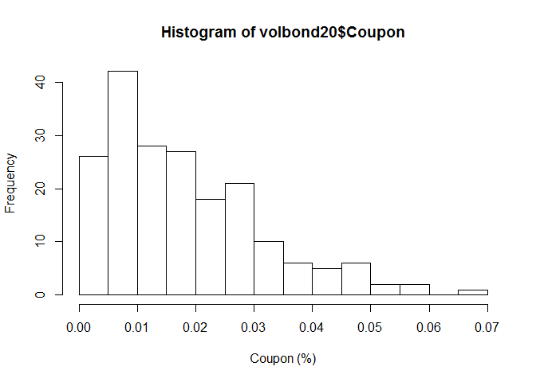

# VolBond
Pieter Pijls  
6 April 2018  

# Load packages


# Import Data

First, I import the swap rate curves from 2002 to 2018.


```r
# Import Data (swap rates)
setwd("C:/PIETER/INTERNSHIP P&V/Volbond")
rates <- read.xlsx("./EURIBOR vanilla interest rate swap contract.xlsx",colNames=TRUE,sheet=1)
# create date object
rates$DATE   <- seq(as.Date("2001/1/1"), by = "month", length.out = 206)

rates20 <- as.data.frame(cbind(seq(as.Date("2001/1/1"), by = "month", length.out = 206), rates$`20`))
rates20$V1 <- as.Date(rates20$V1)
```

We plot the evolution of the swap rate of 20Y. 


```r
# plot evolution swap rate 20y
g <- ggplot(rates20, aes(x=rates20$V1,y=rates20$V2)) + geom_line() + ggtitle("Evolution swap rate 20Y") +
           xlab("Date") + ylab("Rate")

ggplotly(g)
```

```
## We recommend that you use the dev version of ggplot2 with `ggplotly()`
## Install it with: `devtools::install_github('hadley/ggplot2')`
```

<!--html_preserve--><div id="1e6c70bf3fa0" style="width:672px;height:480px;" class="plotly html-widget"></div>
<script type="application/json" data-for="1e6c70bf3fa0">{"x":{"data":[{"x":[978307200000,980985600000,983404800000,986083200000,988675200000,991353600000,993945600000,996624000000,999302400000,1001894400000,1004572800000,1007164800000,1009843200000,1012521600000,1014940800000,1017619200000,1020211200000,1022889600000,1025481600000,1028160000000,1030838400000,1033430400000,1036108800000,1038700800000,1041379200000,1044057600000,1046476800000,1049155200000,1051747200000,1054425600000,1057017600000,1059696000000,1062374400000,1064966400000,1067644800000,1070236800000,1072915200000,1075593600000,1078099200000,1080777600000,1083369600000,1086048000000,1088640000000,1091318400000,1093996800000,1096588800000,1099267200000,1101859200000,1104537600000,1107216000000,1109635200000,1112313600000,1114905600000,1117584000000,1120176000000,1122854400000,1125532800000,1128124800000,1130803200000,1133395200000,1136073600000,1138752000000,1141171200000,1143849600000,1146441600000,1149120000000,1151712000000,1154390400000,1157068800000,1159660800000,1162339200000,1164931200000,1167609600000,1170288000000,1172707200000,1175385600000,1177977600000,1180656000000,1183248000000,1185926400000,1188604800000,1191196800000,1193875200000,1196467200000,1199145600000,1201824000000,1204329600000,1207008000000,1209600000000,1212278400000,1214870400000,1217548800000,1220227200000,1222819200000,1225497600000,1228089600000,1230768000000,1233446400000,1235865600000,1238544000000,1241136000000,1243814400000,1246406400000,1249084800000,1251763200000,1254355200000,1257033600000,1259625600000,1262304000000,1264982400000,1267401600000,1270080000000,1272672000000,1275350400000,1277942400000,1280620800000,1283299200000,1285891200000,1288569600000,1291161600000,1293840000000,1296518400000,1298937600000,1301616000000,1304208000000,1306886400000,1309478400000,1312156800000,1314835200000,1317427200000,1320105600000,1322697600000,1325376000000,1328054400000,1330560000000,1333238400000,1335830400000,1338508800000,1341100800000,1343779200000,1346457600000,1349049600000,1351728000000,1354320000000,1356998400000,1359676800000,1362096000000,1364774400000,1367366400000,1370044800000,1372636800000,1375315200000,1377993600000,1380585600000,1383264000000,1385856000000,1388534400000,1391212800000,1393632000000,1396310400000,1398902400000,1401580800000,1404172800000,1406851200000,1409529600000,1412121600000,1414800000000,1417392000000,1420070400000,1422748800000,1425168000000,1427846400000,1430438400000,1433116800000,1435708800000,1438387200000,1441065600000,1443657600000,1446336000000,1448928000000,1451606400000,1454284800000,1456790400000,1459468800000,1462060800000,1464739200000,1467331200000,1470009600000,1472688000000,1475280000000,1477958400000,1480550400000,1483228800000,1485907200000,1488326400000,1491004800000,1493596800000,1496275200000,1498867200000,1501545600000,1504224000000,1506816000000,1509494400000,1512086400000,1514764800000,1517443200000],"y":[0.0578840062189514,0.0574871789118777,0.0571072497717703,0.0591815737791971,0.0601384710859639,0.0601889219295198,0.0576695411543703,0.056925454055627,0.0581291629006084,0.0522786023624593,0.05329135897758,0.0553622159664202,0.0535007720361358,0.0548013505812813,0.0569178339497414,0.0561540266033478,0.056303497544104,0.0538466652922653,0.0527667045219633,0.051292417014929,0.0500372160407276,0.051859077176703,0.0514562488575132,0.0495832900832987,0.047929966764245,0.0479185005436877,0.0492956890952395,0.0494533699595449,0.0464248330203535,0.0477234865279098,0.050582492828478,0.0492401861656383,0.0490253823784313,0.0504006153705162,0.0511114871088656,0.0501141611844723,0.0505117328467055,0.0492833174113072,0.0485514940766462,0.0500053932529829,0.0513056189555349,0.0499315206309464,0.0489355506081403,0.0475711713703182,0.0470581546196211,0.0462409724751019,0.044739771159586,0.0432702745157486,0.0411619709606142,0.0426279420616661,0.041919395949147,0.0406543711993294,0.0396855621314607,0.037890516052795,0.0385741668925363,0.0368920788658964,0.0371202430587422,0.0388532455523247,0.0391125297741793,0.0374036670497995,0.0391903258520562,0.0390860405542718,0.0420248146955114,0.0438709233507497,0.0448574430577688,0.0451175554956675,0.0440356620818563,0.0421063951312818,0.0409075514818123,0.0402067090652782,0.0400143704268343,0.0425285287054076,0.0439515171557402,0.042833910179792,0.0443073674203595,0.044698063841966,0.0469927103861119,0.0488728454580613,0.0472485176768096,0.0474866491796555,0.0482847345017758,0.047763391981428,0.0482677314304277,0.0485653021034471,0.0466900994937585,0.0463591983604218,0.0468501431466373,0.0482132334274316,0.0497717714181992,0.0496183366199711,0.0481256988469958,0.0466450300305539,0.0459485140675816,0.044761035492373,0.0397481014797922,0.0385875802541084,0.0401050842239556,0.0389496684095773,0.039345469556041,0.0397260802991703,0.0421642558792231,0.0422661332491686,0.0413475154090038,0.0404188954584731,0.0409385771548568,0.0409412818372185,0.0401747151013855,0.0414408005735607,0.0398299708771559,0.039217986543586,0.0388676296599357,0.037484733837242,0.0342217373189223,0.0342871260089294,0.0354411591211346,0.0273487627296855,0.0301626267616884,0.0317963017039276,0.0347309440963882,0.0374303764642338,0.0389082420356673,0.0383983871006267,0.0405622235697496,0.0395959195894658,0.0379957541298985,0.0396056112070834,0.0357724532421572,0.033705773935411,0.0286680370357988,0.0285370885374908,0.030529711227565,0.0271435026036018,0.0261918896815223,0.0265770516604732,0.0269106818688346,0.0264504344179684,0.019409269616241,0.02329831384772,0.0222370955152596,0.0222035183434261,0.0234181822055216,0.0238428711215122,0.0232378361761377,0.0223850311072303,0.0246594207638891,0.0239286919392608,0.0232737725100102,0.0213749622815956,0.024272468186543,0.025724419805631,0.0258536054545062,0.0277279014812911,0.0269253654912084,0.0265391232251633,0.0267045087791612,0.0280600408096062,0.0255423003629987,0.0252486337964837,0.0247546410093095,0.0238572170548603,0.0226487094472047,0.0216910374402913,0.0205241087275653,0.0169613237219288,0.0186821372662454,0.0174813028372889,0.0153849504161738,0.0135977386512511,0.0109224046510357,0.011265351240157,0.00790495854255561,0.00974372444369807,0.0126862725629454,0.0168604040216922,0.014907963515904,0.016621673042772,0.0153036566689899,0.0148845318939701,0.0149904507242155,0.0161740749145103,0.0124617686436606,0.00979767210838383,0.0101995173556131,0.0122633429778819,0.0109691905768251,0.00868815074800946,0.00701269273956911,0.00737020625122488,0.00740883857395568,0.00986070462289106,0.0121415118931036,0.0121201254943643,0.0141091433070014,0.0127236032053998,0.0134542649847793,0.013768873401224,0.014072499801701,0.0149894351223297,0.0158075411612634,0.0141971962866369,0.0155299721668136,0.0148467251047366,0.0146987295472498,0.0145864428558424,0.0155512836746223,0.0160506054971042],"text":["rates20$V1: 11323<br />rates20$V2: 0.057884006","rates20$V1: 11354<br />rates20$V2: 0.057487179","rates20$V1: 11382<br />rates20$V2: 0.057107250","rates20$V1: 11413<br />rates20$V2: 0.059181574","rates20$V1: 11443<br />rates20$V2: 0.060138471","rates20$V1: 11474<br />rates20$V2: 0.060188922","rates20$V1: 11504<br />rates20$V2: 0.057669541","rates20$V1: 11535<br />rates20$V2: 0.056925454","rates20$V1: 11566<br />rates20$V2: 0.058129163","rates20$V1: 11596<br />rates20$V2: 0.052278602","rates20$V1: 11627<br />rates20$V2: 0.053291359","rates20$V1: 11657<br />rates20$V2: 0.055362216","rates20$V1: 11688<br />rates20$V2: 0.053500772","rates20$V1: 11719<br />rates20$V2: 0.054801351","rates20$V1: 11747<br />rates20$V2: 0.056917834","rates20$V1: 11778<br />rates20$V2: 0.056154027","rates20$V1: 11808<br />rates20$V2: 0.056303498","rates20$V1: 11839<br />rates20$V2: 0.053846665","rates20$V1: 11869<br />rates20$V2: 0.052766705","rates20$V1: 11900<br />rates20$V2: 0.051292417","rates20$V1: 11931<br />rates20$V2: 0.050037216","rates20$V1: 11961<br />rates20$V2: 0.051859077","rates20$V1: 11992<br />rates20$V2: 0.051456249","rates20$V1: 12022<br />rates20$V2: 0.049583290","rates20$V1: 12053<br />rates20$V2: 0.047929967","rates20$V1: 12084<br />rates20$V2: 0.047918501","rates20$V1: 12112<br />rates20$V2: 0.049295689","rates20$V1: 12143<br />rates20$V2: 0.049453370","rates20$V1: 12173<br />rates20$V2: 0.046424833","rates20$V1: 12204<br />rates20$V2: 0.047723487","rates20$V1: 12234<br />rates20$V2: 0.050582493","rates20$V1: 12265<br />rates20$V2: 0.049240186","rates20$V1: 12296<br />rates20$V2: 0.049025382","rates20$V1: 12326<br />rates20$V2: 0.050400615","rates20$V1: 12357<br />rates20$V2: 0.051111487","rates20$V1: 12387<br />rates20$V2: 0.050114161","rates20$V1: 12418<br />rates20$V2: 0.050511733","rates20$V1: 12449<br />rates20$V2: 0.049283317","rates20$V1: 12478<br />rates20$V2: 0.048551494","rates20$V1: 12509<br />rates20$V2: 0.050005393","rates20$V1: 12539<br />rates20$V2: 0.051305619","rates20$V1: 12570<br />rates20$V2: 0.049931521","rates20$V1: 12600<br />rates20$V2: 0.048935551","rates20$V1: 12631<br />rates20$V2: 0.047571171","rates20$V1: 12662<br />rates20$V2: 0.047058155","rates20$V1: 12692<br />rates20$V2: 0.046240972","rates20$V1: 12723<br />rates20$V2: 0.044739771","rates20$V1: 12753<br />rates20$V2: 0.043270275","rates20$V1: 12784<br />rates20$V2: 0.041161971","rates20$V1: 12815<br />rates20$V2: 0.042627942","rates20$V1: 12843<br />rates20$V2: 0.041919396","rates20$V1: 12874<br />rates20$V2: 0.040654371","rates20$V1: 12904<br />rates20$V2: 0.039685562","rates20$V1: 12935<br />rates20$V2: 0.037890516","rates20$V1: 12965<br />rates20$V2: 0.038574167","rates20$V1: 12996<br />rates20$V2: 0.036892079","rates20$V1: 13027<br />rates20$V2: 0.037120243","rates20$V1: 13057<br />rates20$V2: 0.038853246","rates20$V1: 13088<br />rates20$V2: 0.039112530","rates20$V1: 13118<br />rates20$V2: 0.037403667","rates20$V1: 13149<br />rates20$V2: 0.039190326","rates20$V1: 13180<br />rates20$V2: 0.039086041","rates20$V1: 13208<br />rates20$V2: 0.042024815","rates20$V1: 13239<br />rates20$V2: 0.043870923","rates20$V1: 13269<br />rates20$V2: 0.044857443","rates20$V1: 13300<br />rates20$V2: 0.045117555","rates20$V1: 13330<br />rates20$V2: 0.044035662","rates20$V1: 13361<br />rates20$V2: 0.042106395","rates20$V1: 13392<br />rates20$V2: 0.040907551","rates20$V1: 13422<br />rates20$V2: 0.040206709","rates20$V1: 13453<br />rates20$V2: 0.040014370","rates20$V1: 13483<br />rates20$V2: 0.042528529","rates20$V1: 13514<br />rates20$V2: 0.043951517","rates20$V1: 13545<br />rates20$V2: 0.042833910","rates20$V1: 13573<br />rates20$V2: 0.044307367","rates20$V1: 13604<br />rates20$V2: 0.044698064","rates20$V1: 13634<br />rates20$V2: 0.046992710","rates20$V1: 13665<br />rates20$V2: 0.048872845","rates20$V1: 13695<br />rates20$V2: 0.047248518","rates20$V1: 13726<br />rates20$V2: 0.047486649","rates20$V1: 13757<br />rates20$V2: 0.048284735","rates20$V1: 13787<br />rates20$V2: 0.047763392","rates20$V1: 13818<br />rates20$V2: 0.048267731","rates20$V1: 13848<br />rates20$V2: 0.048565302","rates20$V1: 13879<br />rates20$V2: 0.046690099","rates20$V1: 13910<br />rates20$V2: 0.046359198","rates20$V1: 13939<br />rates20$V2: 0.046850143","rates20$V1: 13970<br />rates20$V2: 0.048213233","rates20$V1: 14000<br />rates20$V2: 0.049771771","rates20$V1: 14031<br />rates20$V2: 0.049618337","rates20$V1: 14061<br />rates20$V2: 0.048125699","rates20$V1: 14092<br />rates20$V2: 0.046645030","rates20$V1: 14123<br />rates20$V2: 0.045948514","rates20$V1: 14153<br />rates20$V2: 0.044761035","rates20$V1: 14184<br />rates20$V2: 0.039748101","rates20$V1: 14214<br />rates20$V2: 0.038587580","rates20$V1: 14245<br />rates20$V2: 0.040105084","rates20$V1: 14276<br />rates20$V2: 0.038949668","rates20$V1: 14304<br />rates20$V2: 0.039345470","rates20$V1: 14335<br />rates20$V2: 0.039726080","rates20$V1: 14365<br />rates20$V2: 0.042164256","rates20$V1: 14396<br />rates20$V2: 0.042266133","rates20$V1: 14426<br />rates20$V2: 0.041347515","rates20$V1: 14457<br />rates20$V2: 0.040418895","rates20$V1: 14488<br />rates20$V2: 0.040938577","rates20$V1: 14518<br />rates20$V2: 0.040941282","rates20$V1: 14549<br />rates20$V2: 0.040174715","rates20$V1: 14579<br />rates20$V2: 0.041440801","rates20$V1: 14610<br />rates20$V2: 0.039829971","rates20$V1: 14641<br />rates20$V2: 0.039217987","rates20$V1: 14669<br />rates20$V2: 0.038867630","rates20$V1: 14700<br />rates20$V2: 0.037484734","rates20$V1: 14730<br />rates20$V2: 0.034221737","rates20$V1: 14761<br />rates20$V2: 0.034287126","rates20$V1: 14791<br />rates20$V2: 0.035441159","rates20$V1: 14822<br />rates20$V2: 0.027348763","rates20$V1: 14853<br />rates20$V2: 0.030162627","rates20$V1: 14883<br />rates20$V2: 0.031796302","rates20$V1: 14914<br />rates20$V2: 0.034730944","rates20$V1: 14944<br />rates20$V2: 0.037430376","rates20$V1: 14975<br />rates20$V2: 0.038908242","rates20$V1: 15006<br />rates20$V2: 0.038398387","rates20$V1: 15034<br />rates20$V2: 0.040562224","rates20$V1: 15065<br />rates20$V2: 0.039595920","rates20$V1: 15095<br />rates20$V2: 0.037995754","rates20$V1: 15126<br />rates20$V2: 0.039605611","rates20$V1: 15156<br />rates20$V2: 0.035772453","rates20$V1: 15187<br />rates20$V2: 0.033705774","rates20$V1: 15218<br />rates20$V2: 0.028668037","rates20$V1: 15248<br />rates20$V2: 0.028537089","rates20$V1: 15279<br />rates20$V2: 0.030529711","rates20$V1: 15309<br />rates20$V2: 0.027143503","rates20$V1: 15340<br />rates20$V2: 0.026191890","rates20$V1: 15371<br />rates20$V2: 0.026577052","rates20$V1: 15400<br />rates20$V2: 0.026910682","rates20$V1: 15431<br />rates20$V2: 0.026450434","rates20$V1: 15461<br />rates20$V2: 0.019409270","rates20$V1: 15492<br />rates20$V2: 0.023298314","rates20$V1: 15522<br />rates20$V2: 0.022237096","rates20$V1: 15553<br />rates20$V2: 0.022203518","rates20$V1: 15584<br />rates20$V2: 0.023418182","rates20$V1: 15614<br />rates20$V2: 0.023842871","rates20$V1: 15645<br />rates20$V2: 0.023237836","rates20$V1: 15675<br />rates20$V2: 0.022385031","rates20$V1: 15706<br />rates20$V2: 0.024659421","rates20$V1: 15737<br />rates20$V2: 0.023928692","rates20$V1: 15765<br />rates20$V2: 0.023273773","rates20$V1: 15796<br />rates20$V2: 0.021374962","rates20$V1: 15826<br />rates20$V2: 0.024272468","rates20$V1: 15857<br />rates20$V2: 0.025724420","rates20$V1: 15887<br />rates20$V2: 0.025853605","rates20$V1: 15918<br />rates20$V2: 0.027727901","rates20$V1: 15949<br />rates20$V2: 0.026925365","rates20$V1: 15979<br />rates20$V2: 0.026539123","rates20$V1: 16010<br />rates20$V2: 0.026704509","rates20$V1: 16040<br />rates20$V2: 0.028060041","rates20$V1: 16071<br />rates20$V2: 0.025542300","rates20$V1: 16102<br />rates20$V2: 0.025248634","rates20$V1: 16130<br />rates20$V2: 0.024754641","rates20$V1: 16161<br />rates20$V2: 0.023857217","rates20$V1: 16191<br />rates20$V2: 0.022648709","rates20$V1: 16222<br />rates20$V2: 0.021691037","rates20$V1: 16252<br />rates20$V2: 0.020524109","rates20$V1: 16283<br />rates20$V2: 0.016961324","rates20$V1: 16314<br />rates20$V2: 0.018682137","rates20$V1: 16344<br />rates20$V2: 0.017481303","rates20$V1: 16375<br />rates20$V2: 0.015384950","rates20$V1: 16405<br />rates20$V2: 0.013597739","rates20$V1: 16436<br />rates20$V2: 0.010922405","rates20$V1: 16467<br />rates20$V2: 0.011265351","rates20$V1: 16495<br />rates20$V2: 0.007904959","rates20$V1: 16526<br />rates20$V2: 0.009743724","rates20$V1: 16556<br />rates20$V2: 0.012686273","rates20$V1: 16587<br />rates20$V2: 0.016860404","rates20$V1: 16617<br />rates20$V2: 0.014907964","rates20$V1: 16648<br />rates20$V2: 0.016621673","rates20$V1: 16679<br />rates20$V2: 0.015303657","rates20$V1: 16709<br />rates20$V2: 0.014884532","rates20$V1: 16740<br />rates20$V2: 0.014990451","rates20$V1: 16770<br />rates20$V2: 0.016174075","rates20$V1: 16801<br />rates20$V2: 0.012461769","rates20$V1: 16832<br />rates20$V2: 0.009797672","rates20$V1: 16861<br />rates20$V2: 0.010199517","rates20$V1: 16892<br />rates20$V2: 0.012263343","rates20$V1: 16922<br />rates20$V2: 0.010969191","rates20$V1: 16953<br />rates20$V2: 0.008688151","rates20$V1: 16983<br />rates20$V2: 0.007012693","rates20$V1: 17014<br />rates20$V2: 0.007370206","rates20$V1: 17045<br />rates20$V2: 0.007408839","rates20$V1: 17075<br />rates20$V2: 0.009860705","rates20$V1: 17106<br />rates20$V2: 0.012141512","rates20$V1: 17136<br />rates20$V2: 0.012120125","rates20$V1: 17167<br />rates20$V2: 0.014109143","rates20$V1: 17198<br />rates20$V2: 0.012723603","rates20$V1: 17226<br />rates20$V2: 0.013454265","rates20$V1: 17257<br />rates20$V2: 0.013768873","rates20$V1: 17287<br />rates20$V2: 0.014072500","rates20$V1: 17318<br />rates20$V2: 0.014989435","rates20$V1: 17348<br />rates20$V2: 0.015807541","rates20$V1: 17379<br />rates20$V2: 0.014197196","rates20$V1: 17410<br />rates20$V2: 0.015529972","rates20$V1: 17440<br />rates20$V2: 0.014846725","rates20$V1: 17471<br />rates20$V2: 0.014698730","rates20$V1: 17501<br />rates20$V2: 0.014586443","rates20$V1: 17532<br />rates20$V2: 0.015551284","rates20$V1: 17563<br />rates20$V2: 0.016050605"],"type":"scatter","mode":"lines","line":{"width":1.88976377952756,"color":"rgba(0,0,0,1)","dash":"solid"},"hoveron":"points","showlegend":false,"xaxis":"x","yaxis":"y","hoverinfo":"text","frame":null}],"layout":{"margin":{"t":43.7625570776256,"r":7.30593607305936,"b":40.1826484018265,"l":48.9497716894977},"plot_bgcolor":"rgba(235,235,235,1)","paper_bgcolor":"rgba(255,255,255,1)","font":{"color":"rgba(0,0,0,1)","family":"","size":14.6118721461187},"title":"Evolution swap rate 20Y","titlefont":{"color":"rgba(0,0,0,1)","family":"","size":17.5342465753425},"xaxis":{"domain":[0,1],"type":"linear","autorange":false,"tickmode":"array","range":[951350400000,1544400000000],"ticktext":["2005","2010","2015"],"tickvals":[1104537600000,1262304000000,1420070400000],"ticks":"outside","tickcolor":"rgba(51,51,51,1)","ticklen":3.65296803652968,"tickwidth":0.66417600664176,"showticklabels":true,"tickfont":{"color":"rgba(77,77,77,1)","family":"","size":11.689497716895},"tickangle":-0,"showline":false,"linecolor":null,"linewidth":0,"showgrid":true,"gridcolor":"rgba(255,255,255,1)","gridwidth":0.66417600664176,"zeroline":false,"anchor":"y","title":"Date","titlefont":{"color":"rgba(0,0,0,1)","family":"","size":14.6118721461187},"hoverformat":".2f"},"yaxis":{"domain":[0,1],"type":"linear","autorange":false,"tickmode":"array","range":[0.00435388128007157,0.0628477333890173],"ticktext":["0.02","0.04","0.06"],"tickvals":[0.02,0.04,0.06],"ticks":"outside","tickcolor":"rgba(51,51,51,1)","ticklen":3.65296803652968,"tickwidth":0.66417600664176,"showticklabels":true,"tickfont":{"color":"rgba(77,77,77,1)","family":"","size":11.689497716895},"tickangle":-0,"showline":false,"linecolor":null,"linewidth":0,"showgrid":true,"gridcolor":"rgba(255,255,255,1)","gridwidth":0.66417600664176,"zeroline":false,"anchor":"x","title":"Rate","titlefont":{"color":"rgba(0,0,0,1)","family":"","size":14.6118721461187},"hoverformat":".2f"},"shapes":[{"type":"rect","fillcolor":null,"line":{"color":null,"width":0,"linetype":[]},"yref":"paper","xref":"paper","x0":0,"x1":1,"y0":0,"y1":1}],"showlegend":false,"legend":{"bgcolor":"rgba(255,255,255,1)","bordercolor":"transparent","borderwidth":1.88976377952756,"font":{"color":"rgba(0,0,0,1)","family":"","size":11.689497716895}},"hovermode":"closest"},"source":"A","attrs":{"1e6c5a5f1d0":{"x":{},"y":{},"type":"ggplotly"}},"cur_data":"1e6c5a5f1d0","visdat":{"1e6c5a5f1d0":["function (y) ","x"]},"config":{"modeBarButtonsToAdd":[{"name":"Collaborate","icon":{"width":1000,"ascent":500,"descent":-50,"path":"M487 375c7-10 9-23 5-36l-79-259c-3-12-11-23-22-31-11-8-22-12-35-12l-263 0c-15 0-29 5-43 15-13 10-23 23-28 37-5 13-5 25-1 37 0 0 0 3 1 7 1 5 1 8 1 11 0 2 0 4-1 6 0 3-1 5-1 6 1 2 2 4 3 6 1 2 2 4 4 6 2 3 4 5 5 7 5 7 9 16 13 26 4 10 7 19 9 26 0 2 0 5 0 9-1 4-1 6 0 8 0 2 2 5 4 8 3 3 5 5 5 7 4 6 8 15 12 26 4 11 7 19 7 26 1 1 0 4 0 9-1 4-1 7 0 8 1 2 3 5 6 8 4 4 6 6 6 7 4 5 8 13 13 24 4 11 7 20 7 28 1 1 0 4 0 7-1 3-1 6-1 7 0 2 1 4 3 6 1 1 3 4 5 6 2 3 3 5 5 6 1 2 3 5 4 9 2 3 3 7 5 10 1 3 2 6 4 10 2 4 4 7 6 9 2 3 4 5 7 7 3 2 7 3 11 3 3 0 8 0 13-1l0-1c7 2 12 2 14 2l218 0c14 0 25-5 32-16 8-10 10-23 6-37l-79-259c-7-22-13-37-20-43-7-7-19-10-37-10l-248 0c-5 0-9-2-11-5-2-3-2-7 0-12 4-13 18-20 41-20l264 0c5 0 10 2 16 5 5 3 8 6 10 11l85 282c2 5 2 10 2 17 7-3 13-7 17-13z m-304 0c-1-3-1-5 0-7 1-1 3-2 6-2l174 0c2 0 4 1 7 2 2 2 4 4 5 7l6 18c0 3 0 5-1 7-1 1-3 2-6 2l-173 0c-3 0-5-1-8-2-2-2-4-4-4-7z m-24-73c-1-3-1-5 0-7 2-2 3-2 6-2l174 0c2 0 5 0 7 2 3 2 4 4 5 7l6 18c1 2 0 5-1 6-1 2-3 3-5 3l-174 0c-3 0-5-1-7-3-3-1-4-4-5-6z"},"click":"function(gd) { \n        // is this being viewed in RStudio?\n        if (location.search == '?viewer_pane=1') {\n          alert('To learn about plotly for collaboration, visit:\\n https://cpsievert.github.io/plotly_book/plot-ly-for-collaboration.html');\n        } else {\n          window.open('https://cpsievert.github.io/plotly_book/plot-ly-for-collaboration.html', '_blank');\n        }\n      }"}],"cloud":false},"highlight":{"on":"plotly_click","persistent":false,"dynamic":false,"selectize":false,"opacityDim":0.2,"selected":{"opacity":1}},"base_url":"https://plot.ly"},"evals":["config.modeBarButtonsToAdd.0.click"],"jsHooks":{"render":[{"code":"function(el, x) { var ctConfig = crosstalk.var('plotlyCrosstalkOpts').set({\"on\":\"plotly_click\",\"persistent\":false,\"dynamic\":false,\"selectize\":false,\"opacityDim\":0.2,\"selected\":{\"opacity\":1}}); }","data":null}]}}</script><!--/html_preserve-->

# Volbond data

We import data for the Volbond. The first column is the date, the second is the CMS rate 20Y in advance. The third column corresponds with the CMS 20Y rate in Arrears. The final column is the coupon which is equal to 3.5*absolute_value(CMS20Y in Advance - CMS20Y in Arrears).


```r
# Import data for the Volbond
volbond20 <- rates <- read.xlsx("./Volbond20Y.xlsx",colNames=TRUE,sheet=1) 
volbond20$DATE <- seq(as.Date("2001/1/1"), by = "month", length.out = 206)
volbond20 <- volbond20[-1,]
tail(volbond20)
```

```
##           DATE   Advanced    Arrears      Coupon
## 201 2017-09-01 0.01552997 0.01419720 0.028423968
## 202 2017-10-01 0.01484673 0.01552997 0.017451072
## 203 2017-11-01 0.01469873 0.01484673 0.008950262
## 204 2017-12-01 0.01458644 0.01469873 0.008632111
## 205 2018-01-01 0.01555128 0.01458644 0.005047491
## 206 2018-02-01 0.01605061 0.01555128 0.011644508
```

We plot the evolution of the CMS rate 20y and the Volbond coupon. 


```r
g <- ggplot(volbond20, aes(x=volbond20$DATE)) + geom_line(aes(y=volbond20$Advanced, colour = "CMS20Y")) + geom_line(aes(y=volbond20$Coupon, colour = "Coupon (%)")) + ggtitle("Evolution swap rate 20Y") +
           xlab("Date") + ylab("Rate") + theme_bw()
ggplotly(g)
```

```
## We recommend that you use the dev version of ggplot2 with `ggplotly()`
## Install it with: `devtools::install_github('hadley/ggplot2')`
```

<!--html_preserve--><div id="1e6c3218766b" style="width:672px;height:480px;" class="plotly html-widget"></div>
<script type="application/json" data-for="1e6c3218766b">{"x":{"data":[{"x":[980985600000,983404800000,986083200000,988675200000,991353600000,993945600000,996624000000,999302400000,1001894400000,1004572800000,1007164800000,1009843200000,1012521600000,1014940800000,1017619200000,1020211200000,1022889600000,1025481600000,1028160000000,1030838400000,1033430400000,1036108800000,1038700800000,1041379200000,1044057600000,1046476800000,1049155200000,1051747200000,1054425600000,1057017600000,1059696000000,1062374400000,1064966400000,1067644800000,1070236800000,1072915200000,1075593600000,1078099200000,1080777600000,1083369600000,1086048000000,1088640000000,1091318400000,1093996800000,1096588800000,1099267200000,1101859200000,1104537600000,1107216000000,1109635200000,1112313600000,1114905600000,1117584000000,1120176000000,1122854400000,1125532800000,1128124800000,1130803200000,1133395200000,1136073600000,1138752000000,1141171200000,1143849600000,1146441600000,1149120000000,1151712000000,1154390400000,1157068800000,1159660800000,1162339200000,1164931200000,1167609600000,1170288000000,1172707200000,1175385600000,1177977600000,1180656000000,1183248000000,1185926400000,1188604800000,1191196800000,1193875200000,1196467200000,1199145600000,1201824000000,1204329600000,1207008000000,1209600000000,1212278400000,1214870400000,1217548800000,1220227200000,1222819200000,1225497600000,1228089600000,1230768000000,1233446400000,1235865600000,1238544000000,1241136000000,1243814400000,1246406400000,1249084800000,1251763200000,1254355200000,1257033600000,1259625600000,1262304000000,1264982400000,1267401600000,1270080000000,1272672000000,1275350400000,1277942400000,1280620800000,1283299200000,1285891200000,1288569600000,1291161600000,1293840000000,1296518400000,1298937600000,1301616000000,1304208000000,1306886400000,1309478400000,1312156800000,1314835200000,1317427200000,1320105600000,1322697600000,1325376000000,1328054400000,1330560000000,1333238400000,1335830400000,1338508800000,1341100800000,1343779200000,1346457600000,1349049600000,1351728000000,1354320000000,1356998400000,1359676800000,1362096000000,1364774400000,1367366400000,1370044800000,1372636800000,1375315200000,1377993600000,1380585600000,1383264000000,1385856000000,1388534400000,1391212800000,1393632000000,1396310400000,1398902400000,1401580800000,1404172800000,1406851200000,1409529600000,1412121600000,1414800000000,1417392000000,1420070400000,1422748800000,1425168000000,1427846400000,1430438400000,1433116800000,1435708800000,1438387200000,1441065600000,1443657600000,1446336000000,1448928000000,1451606400000,1454284800000,1456790400000,1459468800000,1462060800000,1464739200000,1467331200000,1470009600000,1472688000000,1475280000000,1477958400000,1480550400000,1483228800000,1485907200000,1488326400000,1491004800000,1493596800000,1496275200000,1498867200000,1501545600000,1504224000000,1506816000000,1509494400000,1512086400000,1514764800000,1517443200000],"y":[0.0574871789118777,0.0571072497717703,0.0591815737791971,0.0601384710859639,0.0601889219295198,0.0576695411543703,0.056925454055627,0.0581291629006084,0.0522786023624593,0.05329135897758,0.0553622159664202,0.0535007720361358,0.0548013505812813,0.0569178339497414,0.0561540266033478,0.056303497544104,0.0538466652922653,0.0527667045219633,0.051292417014929,0.0500372160407276,0.051859077176703,0.0514562488575132,0.0495832900832987,0.047929966764245,0.0479185005436877,0.0492956890952395,0.0494533699595449,0.0464248330203535,0.0477234865279098,0.050582492828478,0.0492401861656383,0.0490253823784313,0.0504006153705162,0.0511114871088656,0.0501141611844723,0.0505117328467055,0.0492833174113072,0.0485514940766462,0.0500053932529829,0.0513056189555349,0.0499315206309464,0.0489355506081403,0.0475711713703182,0.0470581546196211,0.0462409724751019,0.044739771159586,0.0432702745157486,0.0411619709606142,0.0426279420616661,0.041919395949147,0.0406543711993294,0.0396855621314607,0.037890516052795,0.0385741668925363,0.0368920788658964,0.0371202430587422,0.0388532455523247,0.0391125297741793,0.0374036670497995,0.0391903258520562,0.0390860405542718,0.0420248146955114,0.0438709233507497,0.0448574430577688,0.0451175554956675,0.0440356620818563,0.0421063951312818,0.0409075514818123,0.0402067090652782,0.0400143704268343,0.0425285287054076,0.0439515171557402,0.042833910179792,0.0443073674203595,0.044698063841966,0.0469927103861119,0.0488728454580613,0.0472485176768096,0.0474866491796555,0.0482847345017758,0.047763391981428,0.0482677314304277,0.0485653021034471,0.0466900994937585,0.0463591983604218,0.0468501431466373,0.0482132334274316,0.0497717714181992,0.0496183366199711,0.0481256988469958,0.0466450300305539,0.0459485140675816,0.044761035492373,0.0397481014797922,0.0385875802541084,0.0401050842239556,0.0389496684095773,0.039345469556041,0.0397260802991703,0.0421642558792231,0.0422661332491686,0.0413475154090038,0.0404188954584731,0.0409385771548568,0.0409412818372185,0.0401747151013855,0.0414408005735607,0.0398299708771559,0.039217986543586,0.0388676296599357,0.037484733837242,0.0342217373189223,0.0342871260089294,0.0354411591211346,0.0273487627296855,0.0301626267616884,0.0317963017039276,0.0347309440963882,0.0374303764642338,0.0389082420356673,0.0383983871006267,0.0405622235697496,0.0395959195894658,0.0379957541298985,0.0396056112070834,0.0357724532421572,0.033705773935411,0.0286680370357988,0.0285370885374908,0.030529711227565,0.0271435026036018,0.0261918896815223,0.0265770516604732,0.0269106818688346,0.0264504344179684,0.019409269616241,0.02329831384772,0.0222370955152596,0.0222035183434261,0.0234181822055216,0.0238428711215122,0.0232378361761377,0.0223850311072303,0.0246594207638891,0.0239286919392608,0.0232737725100102,0.0213749622815956,0.024272468186543,0.025724419805631,0.0258536054545062,0.0277279014812911,0.0269253654912084,0.0265391232251633,0.0267045087791612,0.0280600408096062,0.0255423003629987,0.0252486337964837,0.0247546410093095,0.0238572170548603,0.0226487094472047,0.0216910374402913,0.0205241087275653,0.0169613237219288,0.0186821372662454,0.0174813028372889,0.0153849504161738,0.0135977386512511,0.0109224046510357,0.011265351240157,0.00790495854255561,0.00974372444369807,0.0126862725629454,0.0168604040216922,0.014907963515904,0.016621673042772,0.0153036566689899,0.0148845318939701,0.0149904507242155,0.0161740749145103,0.0124617686436606,0.00979767210838383,0.0101995173556131,0.0122633429778819,0.0109691905768251,0.00868815074800946,0.00701269273956911,0.00737020625122488,0.00740883857395568,0.00986070462289106,0.0121415118931036,0.0121201254943643,0.0141091433070014,0.0127236032053998,0.0134542649847793,0.013768873401224,0.014072499801701,0.0149894351223297,0.0158075411612634,0.0141971962866369,0.0155299721668136,0.0148467251047366,0.0146987295472498,0.0145864428558424,0.0155512836746223,0.0160506054971042],"text":["volbond20$Advanced: 0.057487179<br />CMS20Y: CMS20Y<br />volbond20$DATE: 11354","volbond20$Advanced: 0.057107250<br />CMS20Y: CMS20Y<br />volbond20$DATE: 11382","volbond20$Advanced: 0.059181574<br />CMS20Y: CMS20Y<br />volbond20$DATE: 11413","volbond20$Advanced: 0.060138471<br />CMS20Y: CMS20Y<br />volbond20$DATE: 11443","volbond20$Advanced: 0.060188922<br />CMS20Y: CMS20Y<br />volbond20$DATE: 11474","volbond20$Advanced: 0.057669541<br />CMS20Y: CMS20Y<br />volbond20$DATE: 11504","volbond20$Advanced: 0.056925454<br />CMS20Y: CMS20Y<br />volbond20$DATE: 11535","volbond20$Advanced: 0.058129163<br />CMS20Y: CMS20Y<br />volbond20$DATE: 11566","volbond20$Advanced: 0.052278602<br />CMS20Y: CMS20Y<br />volbond20$DATE: 11596","volbond20$Advanced: 0.053291359<br />CMS20Y: CMS20Y<br />volbond20$DATE: 11627","volbond20$Advanced: 0.055362216<br />CMS20Y: CMS20Y<br />volbond20$DATE: 11657","volbond20$Advanced: 0.053500772<br />CMS20Y: CMS20Y<br />volbond20$DATE: 11688","volbond20$Advanced: 0.054801351<br />CMS20Y: CMS20Y<br />volbond20$DATE: 11719","volbond20$Advanced: 0.056917834<br />CMS20Y: CMS20Y<br />volbond20$DATE: 11747","volbond20$Advanced: 0.056154027<br />CMS20Y: CMS20Y<br />volbond20$DATE: 11778","volbond20$Advanced: 0.056303498<br />CMS20Y: CMS20Y<br />volbond20$DATE: 11808","volbond20$Advanced: 0.053846665<br />CMS20Y: CMS20Y<br />volbond20$DATE: 11839","volbond20$Advanced: 0.052766705<br />CMS20Y: CMS20Y<br />volbond20$DATE: 11869","volbond20$Advanced: 0.051292417<br />CMS20Y: CMS20Y<br />volbond20$DATE: 11900","volbond20$Advanced: 0.050037216<br />CMS20Y: CMS20Y<br />volbond20$DATE: 11931","volbond20$Advanced: 0.051859077<br />CMS20Y: CMS20Y<br />volbond20$DATE: 11961","volbond20$Advanced: 0.051456249<br />CMS20Y: CMS20Y<br />volbond20$DATE: 11992","volbond20$Advanced: 0.049583290<br />CMS20Y: CMS20Y<br />volbond20$DATE: 12022","volbond20$Advanced: 0.047929967<br />CMS20Y: CMS20Y<br />volbond20$DATE: 12053","volbond20$Advanced: 0.047918501<br />CMS20Y: CMS20Y<br />volbond20$DATE: 12084","volbond20$Advanced: 0.049295689<br />CMS20Y: CMS20Y<br />volbond20$DATE: 12112","volbond20$Advanced: 0.049453370<br />CMS20Y: CMS20Y<br />volbond20$DATE: 12143","volbond20$Advanced: 0.046424833<br />CMS20Y: CMS20Y<br />volbond20$DATE: 12173","volbond20$Advanced: 0.047723487<br />CMS20Y: CMS20Y<br />volbond20$DATE: 12204","volbond20$Advanced: 0.050582493<br />CMS20Y: CMS20Y<br />volbond20$DATE: 12234","volbond20$Advanced: 0.049240186<br />CMS20Y: CMS20Y<br />volbond20$DATE: 12265","volbond20$Advanced: 0.049025382<br />CMS20Y: CMS20Y<br />volbond20$DATE: 12296","volbond20$Advanced: 0.050400615<br />CMS20Y: CMS20Y<br />volbond20$DATE: 12326","volbond20$Advanced: 0.051111487<br />CMS20Y: CMS20Y<br />volbond20$DATE: 12357","volbond20$Advanced: 0.050114161<br />CMS20Y: CMS20Y<br />volbond20$DATE: 12387","volbond20$Advanced: 0.050511733<br />CMS20Y: CMS20Y<br />volbond20$DATE: 12418","volbond20$Advanced: 0.049283317<br />CMS20Y: CMS20Y<br />volbond20$DATE: 12449","volbond20$Advanced: 0.048551494<br />CMS20Y: CMS20Y<br />volbond20$DATE: 12478","volbond20$Advanced: 0.050005393<br />CMS20Y: CMS20Y<br />volbond20$DATE: 12509","volbond20$Advanced: 0.051305619<br />CMS20Y: CMS20Y<br />volbond20$DATE: 12539","volbond20$Advanced: 0.049931521<br />CMS20Y: CMS20Y<br />volbond20$DATE: 12570","volbond20$Advanced: 0.048935551<br />CMS20Y: CMS20Y<br />volbond20$DATE: 12600","volbond20$Advanced: 0.047571171<br />CMS20Y: CMS20Y<br />volbond20$DATE: 12631","volbond20$Advanced: 0.047058155<br />CMS20Y: CMS20Y<br />volbond20$DATE: 12662","volbond20$Advanced: 0.046240972<br />CMS20Y: CMS20Y<br />volbond20$DATE: 12692","volbond20$Advanced: 0.044739771<br />CMS20Y: CMS20Y<br />volbond20$DATE: 12723","volbond20$Advanced: 0.043270275<br />CMS20Y: CMS20Y<br />volbond20$DATE: 12753","volbond20$Advanced: 0.041161971<br />CMS20Y: CMS20Y<br />volbond20$DATE: 12784","volbond20$Advanced: 0.042627942<br />CMS20Y: CMS20Y<br />volbond20$DATE: 12815","volbond20$Advanced: 0.041919396<br />CMS20Y: CMS20Y<br />volbond20$DATE: 12843","volbond20$Advanced: 0.040654371<br />CMS20Y: CMS20Y<br />volbond20$DATE: 12874","volbond20$Advanced: 0.039685562<br />CMS20Y: CMS20Y<br />volbond20$DATE: 12904","volbond20$Advanced: 0.037890516<br />CMS20Y: CMS20Y<br />volbond20$DATE: 12935","volbond20$Advanced: 0.038574167<br />CMS20Y: CMS20Y<br />volbond20$DATE: 12965","volbond20$Advanced: 0.036892079<br />CMS20Y: CMS20Y<br />volbond20$DATE: 12996","volbond20$Advanced: 0.037120243<br />CMS20Y: CMS20Y<br />volbond20$DATE: 13027","volbond20$Advanced: 0.038853246<br />CMS20Y: CMS20Y<br />volbond20$DATE: 13057","volbond20$Advanced: 0.039112530<br />CMS20Y: CMS20Y<br />volbond20$DATE: 13088","volbond20$Advanced: 0.037403667<br />CMS20Y: CMS20Y<br />volbond20$DATE: 13118","volbond20$Advanced: 0.039190326<br />CMS20Y: CMS20Y<br />volbond20$DATE: 13149","volbond20$Advanced: 0.039086041<br />CMS20Y: CMS20Y<br />volbond20$DATE: 13180","volbond20$Advanced: 0.042024815<br />CMS20Y: CMS20Y<br />volbond20$DATE: 13208","volbond20$Advanced: 0.043870923<br />CMS20Y: CMS20Y<br />volbond20$DATE: 13239","volbond20$Advanced: 0.044857443<br />CMS20Y: CMS20Y<br />volbond20$DATE: 13269","volbond20$Advanced: 0.045117555<br />CMS20Y: CMS20Y<br />volbond20$DATE: 13300","volbond20$Advanced: 0.044035662<br />CMS20Y: CMS20Y<br />volbond20$DATE: 13330","volbond20$Advanced: 0.042106395<br />CMS20Y: CMS20Y<br />volbond20$DATE: 13361","volbond20$Advanced: 0.040907551<br />CMS20Y: CMS20Y<br />volbond20$DATE: 13392","volbond20$Advanced: 0.040206709<br />CMS20Y: CMS20Y<br />volbond20$DATE: 13422","volbond20$Advanced: 0.040014370<br />CMS20Y: CMS20Y<br />volbond20$DATE: 13453","volbond20$Advanced: 0.042528529<br />CMS20Y: CMS20Y<br />volbond20$DATE: 13483","volbond20$Advanced: 0.043951517<br />CMS20Y: CMS20Y<br />volbond20$DATE: 13514","volbond20$Advanced: 0.042833910<br />CMS20Y: CMS20Y<br />volbond20$DATE: 13545","volbond20$Advanced: 0.044307367<br />CMS20Y: CMS20Y<br />volbond20$DATE: 13573","volbond20$Advanced: 0.044698064<br />CMS20Y: CMS20Y<br />volbond20$DATE: 13604","volbond20$Advanced: 0.046992710<br />CMS20Y: CMS20Y<br />volbond20$DATE: 13634","volbond20$Advanced: 0.048872845<br />CMS20Y: CMS20Y<br />volbond20$DATE: 13665","volbond20$Advanced: 0.047248518<br />CMS20Y: CMS20Y<br />volbond20$DATE: 13695","volbond20$Advanced: 0.047486649<br />CMS20Y: CMS20Y<br />volbond20$DATE: 13726","volbond20$Advanced: 0.048284735<br />CMS20Y: CMS20Y<br />volbond20$DATE: 13757","volbond20$Advanced: 0.047763392<br />CMS20Y: CMS20Y<br />volbond20$DATE: 13787","volbond20$Advanced: 0.048267731<br />CMS20Y: CMS20Y<br />volbond20$DATE: 13818","volbond20$Advanced: 0.048565302<br />CMS20Y: CMS20Y<br />volbond20$DATE: 13848","volbond20$Advanced: 0.046690099<br />CMS20Y: CMS20Y<br />volbond20$DATE: 13879","volbond20$Advanced: 0.046359198<br />CMS20Y: CMS20Y<br />volbond20$DATE: 13910","volbond20$Advanced: 0.046850143<br />CMS20Y: CMS20Y<br />volbond20$DATE: 13939","volbond20$Advanced: 0.048213233<br />CMS20Y: CMS20Y<br />volbond20$DATE: 13970","volbond20$Advanced: 0.049771771<br />CMS20Y: CMS20Y<br />volbond20$DATE: 14000","volbond20$Advanced: 0.049618337<br />CMS20Y: CMS20Y<br />volbond20$DATE: 14031","volbond20$Advanced: 0.048125699<br />CMS20Y: CMS20Y<br />volbond20$DATE: 14061","volbond20$Advanced: 0.046645030<br />CMS20Y: CMS20Y<br />volbond20$DATE: 14092","volbond20$Advanced: 0.045948514<br />CMS20Y: CMS20Y<br />volbond20$DATE: 14123","volbond20$Advanced: 0.044761035<br />CMS20Y: CMS20Y<br />volbond20$DATE: 14153","volbond20$Advanced: 0.039748101<br />CMS20Y: CMS20Y<br />volbond20$DATE: 14184","volbond20$Advanced: 0.038587580<br />CMS20Y: CMS20Y<br />volbond20$DATE: 14214","volbond20$Advanced: 0.040105084<br />CMS20Y: CMS20Y<br />volbond20$DATE: 14245","volbond20$Advanced: 0.038949668<br />CMS20Y: CMS20Y<br />volbond20$DATE: 14276","volbond20$Advanced: 0.039345470<br />CMS20Y: CMS20Y<br />volbond20$DATE: 14304","volbond20$Advanced: 0.039726080<br />CMS20Y: CMS20Y<br />volbond20$DATE: 14335","volbond20$Advanced: 0.042164256<br />CMS20Y: CMS20Y<br />volbond20$DATE: 14365","volbond20$Advanced: 0.042266133<br />CMS20Y: CMS20Y<br />volbond20$DATE: 14396","volbond20$Advanced: 0.041347515<br />CMS20Y: CMS20Y<br />volbond20$DATE: 14426","volbond20$Advanced: 0.040418895<br />CMS20Y: CMS20Y<br />volbond20$DATE: 14457","volbond20$Advanced: 0.040938577<br />CMS20Y: CMS20Y<br />volbond20$DATE: 14488","volbond20$Advanced: 0.040941282<br />CMS20Y: CMS20Y<br />volbond20$DATE: 14518","volbond20$Advanced: 0.040174715<br />CMS20Y: CMS20Y<br />volbond20$DATE: 14549","volbond20$Advanced: 0.041440801<br />CMS20Y: CMS20Y<br />volbond20$DATE: 14579","volbond20$Advanced: 0.039829971<br />CMS20Y: CMS20Y<br />volbond20$DATE: 14610","volbond20$Advanced: 0.039217987<br />CMS20Y: CMS20Y<br />volbond20$DATE: 14641","volbond20$Advanced: 0.038867630<br />CMS20Y: CMS20Y<br />volbond20$DATE: 14669","volbond20$Advanced: 0.037484734<br />CMS20Y: CMS20Y<br />volbond20$DATE: 14700","volbond20$Advanced: 0.034221737<br />CMS20Y: CMS20Y<br />volbond20$DATE: 14730","volbond20$Advanced: 0.034287126<br />CMS20Y: CMS20Y<br />volbond20$DATE: 14761","volbond20$Advanced: 0.035441159<br />CMS20Y: CMS20Y<br />volbond20$DATE: 14791","volbond20$Advanced: 0.027348763<br />CMS20Y: CMS20Y<br />volbond20$DATE: 14822","volbond20$Advanced: 0.030162627<br />CMS20Y: CMS20Y<br />volbond20$DATE: 14853","volbond20$Advanced: 0.031796302<br />CMS20Y: CMS20Y<br />volbond20$DATE: 14883","volbond20$Advanced: 0.034730944<br />CMS20Y: CMS20Y<br />volbond20$DATE: 14914","volbond20$Advanced: 0.037430376<br />CMS20Y: CMS20Y<br />volbond20$DATE: 14944","volbond20$Advanced: 0.038908242<br />CMS20Y: CMS20Y<br />volbond20$DATE: 14975","volbond20$Advanced: 0.038398387<br />CMS20Y: CMS20Y<br />volbond20$DATE: 15006","volbond20$Advanced: 0.040562224<br />CMS20Y: CMS20Y<br />volbond20$DATE: 15034","volbond20$Advanced: 0.039595920<br />CMS20Y: CMS20Y<br />volbond20$DATE: 15065","volbond20$Advanced: 0.037995754<br />CMS20Y: CMS20Y<br />volbond20$DATE: 15095","volbond20$Advanced: 0.039605611<br />CMS20Y: CMS20Y<br />volbond20$DATE: 15126","volbond20$Advanced: 0.035772453<br />CMS20Y: CMS20Y<br />volbond20$DATE: 15156","volbond20$Advanced: 0.033705774<br />CMS20Y: CMS20Y<br />volbond20$DATE: 15187","volbond20$Advanced: 0.028668037<br />CMS20Y: CMS20Y<br />volbond20$DATE: 15218","volbond20$Advanced: 0.028537089<br />CMS20Y: CMS20Y<br />volbond20$DATE: 15248","volbond20$Advanced: 0.030529711<br />CMS20Y: CMS20Y<br />volbond20$DATE: 15279","volbond20$Advanced: 0.027143503<br />CMS20Y: CMS20Y<br />volbond20$DATE: 15309","volbond20$Advanced: 0.026191890<br />CMS20Y: CMS20Y<br />volbond20$DATE: 15340","volbond20$Advanced: 0.026577052<br />CMS20Y: CMS20Y<br />volbond20$DATE: 15371","volbond20$Advanced: 0.026910682<br />CMS20Y: CMS20Y<br />volbond20$DATE: 15400","volbond20$Advanced: 0.026450434<br />CMS20Y: CMS20Y<br />volbond20$DATE: 15431","volbond20$Advanced: 0.019409270<br />CMS20Y: CMS20Y<br />volbond20$DATE: 15461","volbond20$Advanced: 0.023298314<br />CMS20Y: CMS20Y<br />volbond20$DATE: 15492","volbond20$Advanced: 0.022237096<br />CMS20Y: CMS20Y<br />volbond20$DATE: 15522","volbond20$Advanced: 0.022203518<br />CMS20Y: CMS20Y<br />volbond20$DATE: 15553","volbond20$Advanced: 0.023418182<br />CMS20Y: CMS20Y<br />volbond20$DATE: 15584","volbond20$Advanced: 0.023842871<br />CMS20Y: CMS20Y<br />volbond20$DATE: 15614","volbond20$Advanced: 0.023237836<br />CMS20Y: CMS20Y<br />volbond20$DATE: 15645","volbond20$Advanced: 0.022385031<br />CMS20Y: CMS20Y<br />volbond20$DATE: 15675","volbond20$Advanced: 0.024659421<br />CMS20Y: CMS20Y<br />volbond20$DATE: 15706","volbond20$Advanced: 0.023928692<br />CMS20Y: CMS20Y<br />volbond20$DATE: 15737","volbond20$Advanced: 0.023273773<br />CMS20Y: CMS20Y<br />volbond20$DATE: 15765","volbond20$Advanced: 0.021374962<br />CMS20Y: CMS20Y<br />volbond20$DATE: 15796","volbond20$Advanced: 0.024272468<br />CMS20Y: CMS20Y<br />volbond20$DATE: 15826","volbond20$Advanced: 0.025724420<br />CMS20Y: CMS20Y<br />volbond20$DATE: 15857","volbond20$Advanced: 0.025853605<br />CMS20Y: CMS20Y<br />volbond20$DATE: 15887","volbond20$Advanced: 0.027727901<br />CMS20Y: CMS20Y<br />volbond20$DATE: 15918","volbond20$Advanced: 0.026925365<br />CMS20Y: CMS20Y<br />volbond20$DATE: 15949","volbond20$Advanced: 0.026539123<br />CMS20Y: CMS20Y<br />volbond20$DATE: 15979","volbond20$Advanced: 0.026704509<br />CMS20Y: CMS20Y<br />volbond20$DATE: 16010","volbond20$Advanced: 0.028060041<br />CMS20Y: CMS20Y<br />volbond20$DATE: 16040","volbond20$Advanced: 0.025542300<br />CMS20Y: CMS20Y<br />volbond20$DATE: 16071","volbond20$Advanced: 0.025248634<br />CMS20Y: CMS20Y<br />volbond20$DATE: 16102","volbond20$Advanced: 0.024754641<br />CMS20Y: CMS20Y<br />volbond20$DATE: 16130","volbond20$Advanced: 0.023857217<br />CMS20Y: CMS20Y<br />volbond20$DATE: 16161","volbond20$Advanced: 0.022648709<br />CMS20Y: CMS20Y<br />volbond20$DATE: 16191","volbond20$Advanced: 0.021691037<br />CMS20Y: CMS20Y<br />volbond20$DATE: 16222","volbond20$Advanced: 0.020524109<br />CMS20Y: CMS20Y<br />volbond20$DATE: 16252","volbond20$Advanced: 0.016961324<br />CMS20Y: CMS20Y<br />volbond20$DATE: 16283","volbond20$Advanced: 0.018682137<br />CMS20Y: CMS20Y<br />volbond20$DATE: 16314","volbond20$Advanced: 0.017481303<br />CMS20Y: CMS20Y<br />volbond20$DATE: 16344","volbond20$Advanced: 0.015384950<br />CMS20Y: CMS20Y<br />volbond20$DATE: 16375","volbond20$Advanced: 0.013597739<br />CMS20Y: CMS20Y<br />volbond20$DATE: 16405","volbond20$Advanced: 0.010922405<br />CMS20Y: CMS20Y<br />volbond20$DATE: 16436","volbond20$Advanced: 0.011265351<br />CMS20Y: CMS20Y<br />volbond20$DATE: 16467","volbond20$Advanced: 0.007904959<br />CMS20Y: CMS20Y<br />volbond20$DATE: 16495","volbond20$Advanced: 0.009743724<br />CMS20Y: CMS20Y<br />volbond20$DATE: 16526","volbond20$Advanced: 0.012686273<br />CMS20Y: CMS20Y<br />volbond20$DATE: 16556","volbond20$Advanced: 0.016860404<br />CMS20Y: CMS20Y<br />volbond20$DATE: 16587","volbond20$Advanced: 0.014907964<br />CMS20Y: CMS20Y<br />volbond20$DATE: 16617","volbond20$Advanced: 0.016621673<br />CMS20Y: CMS20Y<br />volbond20$DATE: 16648","volbond20$Advanced: 0.015303657<br />CMS20Y: CMS20Y<br />volbond20$DATE: 16679","volbond20$Advanced: 0.014884532<br />CMS20Y: CMS20Y<br />volbond20$DATE: 16709","volbond20$Advanced: 0.014990451<br />CMS20Y: CMS20Y<br />volbond20$DATE: 16740","volbond20$Advanced: 0.016174075<br />CMS20Y: CMS20Y<br />volbond20$DATE: 16770","volbond20$Advanced: 0.012461769<br />CMS20Y: CMS20Y<br />volbond20$DATE: 16801","volbond20$Advanced: 0.009797672<br />CMS20Y: CMS20Y<br />volbond20$DATE: 16832","volbond20$Advanced: 0.010199517<br />CMS20Y: CMS20Y<br />volbond20$DATE: 16861","volbond20$Advanced: 0.012263343<br />CMS20Y: CMS20Y<br />volbond20$DATE: 16892","volbond20$Advanced: 0.010969191<br />CMS20Y: CMS20Y<br />volbond20$DATE: 16922","volbond20$Advanced: 0.008688151<br />CMS20Y: CMS20Y<br />volbond20$DATE: 16953","volbond20$Advanced: 0.007012693<br />CMS20Y: CMS20Y<br />volbond20$DATE: 16983","volbond20$Advanced: 0.007370206<br />CMS20Y: CMS20Y<br />volbond20$DATE: 17014","volbond20$Advanced: 0.007408839<br />CMS20Y: CMS20Y<br />volbond20$DATE: 17045","volbond20$Advanced: 0.009860705<br />CMS20Y: CMS20Y<br />volbond20$DATE: 17075","volbond20$Advanced: 0.012141512<br />CMS20Y: CMS20Y<br />volbond20$DATE: 17106","volbond20$Advanced: 0.012120125<br />CMS20Y: CMS20Y<br />volbond20$DATE: 17136","volbond20$Advanced: 0.014109143<br />CMS20Y: CMS20Y<br />volbond20$DATE: 17167","volbond20$Advanced: 0.012723603<br />CMS20Y: CMS20Y<br />volbond20$DATE: 17198","volbond20$Advanced: 0.013454265<br />CMS20Y: CMS20Y<br />volbond20$DATE: 17226","volbond20$Advanced: 0.013768873<br />CMS20Y: CMS20Y<br />volbond20$DATE: 17257","volbond20$Advanced: 0.014072500<br />CMS20Y: CMS20Y<br />volbond20$DATE: 17287","volbond20$Advanced: 0.014989435<br />CMS20Y: CMS20Y<br />volbond20$DATE: 17318","volbond20$Advanced: 0.015807541<br />CMS20Y: CMS20Y<br />volbond20$DATE: 17348","volbond20$Advanced: 0.014197196<br />CMS20Y: CMS20Y<br />volbond20$DATE: 17379","volbond20$Advanced: 0.015529972<br />CMS20Y: CMS20Y<br />volbond20$DATE: 17410","volbond20$Advanced: 0.014846725<br />CMS20Y: CMS20Y<br />volbond20$DATE: 17440","volbond20$Advanced: 0.014698730<br />CMS20Y: CMS20Y<br />volbond20$DATE: 17471","volbond20$Advanced: 0.014586443<br />CMS20Y: CMS20Y<br />volbond20$DATE: 17501","volbond20$Advanced: 0.015551284<br />CMS20Y: CMS20Y<br />volbond20$DATE: 17532","volbond20$Advanced: 0.016050605<br />CMS20Y: CMS20Y<br />volbond20$DATE: 17563"],"type":"scatter","mode":"lines","line":{"width":1.88976377952756,"color":"rgba(248,118,109,1)","dash":"solid"},"hoveron":"points","name":"CMS20Y","legendgroup":"CMS20Y","showlegend":true,"xaxis":"x","yaxis":"y","hoverinfo":"text","frame":null},{"x":[980985600000,983404800000,986083200000,988675200000,991353600000,993945600000,996624000000,999302400000,1001894400000,1004572800000,1007164800000,1009843200000,1012521600000,1014940800000,1017619200000,1020211200000,1022889600000,1025481600000,1028160000000,1030838400000,1033430400000,1036108800000,1038700800000,1041379200000,1044057600000,1046476800000,1049155200000,1051747200000,1054425600000,1057017600000,1059696000000,1062374400000,1064966400000,1067644800000,1070236800000,1072915200000,1075593600000,1078099200000,1080777600000,1083369600000,1086048000000,1088640000000,1091318400000,1093996800000,1096588800000,1099267200000,1101859200000,1104537600000,1107216000000,1109635200000,1112313600000,1114905600000,1117584000000,1120176000000,1122854400000,1125532800000,1128124800000,1130803200000,1133395200000,1136073600000,1138752000000,1141171200000,1143849600000,1146441600000,1149120000000,1151712000000,1154390400000,1157068800000,1159660800000,1162339200000,1164931200000,1167609600000,1170288000000,1172707200000,1175385600000,1177977600000,1180656000000,1183248000000,1185926400000,1188604800000,1191196800000,1193875200000,1196467200000,1199145600000,1201824000000,1204329600000,1207008000000,1209600000000,1212278400000,1214870400000,1217548800000,1220227200000,1222819200000,1225497600000,1228089600000,1230768000000,1233446400000,1235865600000,1238544000000,1241136000000,1243814400000,1246406400000,1249084800000,1251763200000,1254355200000,1257033600000,1259625600000,1262304000000,1264982400000,1267401600000,1270080000000,1272672000000,1275350400000,1277942400000,1280620800000,1283299200000,1285891200000,1288569600000,1291161600000,1293840000000,1296518400000,1298937600000,1301616000000,1304208000000,1306886400000,1309478400000,1312156800000,1314835200000,1317427200000,1320105600000,1322697600000,1325376000000,1328054400000,1330560000000,1333238400000,1335830400000,1338508800000,1341100800000,1343779200000,1346457600000,1349049600000,1351728000000,1354320000000,1356998400000,1359676800000,1362096000000,1364774400000,1367366400000,1370044800000,1372636800000,1375315200000,1377993600000,1380585600000,1383264000000,1385856000000,1388534400000,1391212800000,1393632000000,1396310400000,1398902400000,1401580800000,1404172800000,1406851200000,1409529600000,1412121600000,1414800000000,1417392000000,1420070400000,1422748800000,1425168000000,1427846400000,1430438400000,1433116800000,1435708800000,1438387200000,1441065600000,1443657600000,1446336000000,1448928000000,1451606400000,1454284800000,1456790400000,1459468800000,1462060800000,1464739200000,1467331200000,1470009600000,1472688000000,1475280000000,1477958400000,1480550400000,1483228800000,1485907200000,1488326400000,1491004800000,1493596800000,1496275200000,1498867200000,1501545600000,1504224000000,1506816000000,1509494400000,1512086400000,1514764800000,1517443200000],"y":[null,null,null,null,null,null,null,null,null,null,null,0.0153413196398546,0.00940039915708747,0.000662955377101156,0.0105964151154724,0.01342240739651,0.0221978982303908,0.0171599282134244,0.0197156296424432,0.0283218140095826,0.00146833815014682,0.00642288542023357,0.0202262405909254,0.0194978184516177,0.0240899751315774,0.0266775069907569,0.0234522982533104,0.0345753258331266,0.0214311256752442,0.00764474092719849,0.00718280797251748,0.00354141781803729,0.00510461632165404,0.00120666612026665,0.00185804885410774,0.00903618128861171,0.00477685903666826,0.00260468256507644,0.00193208152703303,0.0170827507731349,0.00772811936062831,0.00576429777118211,0.00584155178362012,0.00688529715583559,0.0145587501339499,0.0223010058224786,0.0239536033405331,0.0327241666013197,0.0232938137237439,0.0232123434462471,0.0327285771877872,0.0406701988842597,0.0421435160235301,0.0362648430046139,0.0373768237654763,0.0347826904630761,0.0258570442297201,0.0196953448489234,0.0205331261308217,0.00690075787995294,0.01239665527588,0.000368965612275438,0.0112579325299712,0.0181015832420783,0.0252946380500537,0.01911523316262,0.0182501069288488,0.0132555794807453,0.00473712229533712,0.00315644228429257,0.0179370157946282,0.0166641695628939,0.0131175436893206,0.00798893453696822,0.00289499171925676,0.00747343564920092,0.0131435148683783,0.0112449945823367,0.018830889169308,0.0258201405698722,0.0264483902065241,0.0288867635125767,0.0211287068931383,0.00958503818306428,0.0123385086322041,0.00889971504197244,0.0123030935491297,0.00972671361230552,0.00260921906668459,0.00307013409565183,0.00294566702185555,0.00817677151967956,0.0105082477116923,0.029818704827224,0.0349220264726853,0.0230475534443105,0.0259333548279556,0.0262663575670872,0.0297050359489145,0.0266263043864164,0.025732711797809,0.0237236420329721,0.0217914710022828,0.0175347791945369,0.013369137793041,0.00149314767557635,0.00998627111808281,0.000962896713798782,0.000939113469030438,0.00167243963636868,0.00784471261674912,0.0277988149610526,0.0279265253408371,0.0206722470075423,0.0457454645507568,0.0377158263760893,0.0320074304665182,0.0190531985174905,0.0140364843826439,0.00322605094520999,0.00286859805035757,0.00593107868434889,0.00738915013278325,0.0132090588384167,0.0186146981935391,0.00115952942357914,0.0222495392200394,0.00523106404061367,0.0114072460825286,0.0147043150408813,0.0360040585122122,0.0445072332395077,0.0413746740405373,0.0477803959532026,0.0460091981002408,0.0650526957978015,0.0570755407577722,0.0473737520441417,0.0402578945719471,0.0183744919059702,0.0164297609559251,0.0255215626799954,0.0166546502373002,0.005363641211716,0.00926925902424339,0.0127291827558853,0.0177641524773046,0.017021194996057,0.00849137085268858,0.0126577847873632,0.0193353409825273,0.012275141499904,0.00943688236277872,0.0121333541105823,0.0198625339583157,0.00309007859688333,0.00461979650028002,0.00518303974754743,0.00868789170642644,0.00568315558768395,0.0141168382786889,0.0186532385442932,0.0376830221577679,0.0288512987873707,0.0317023713575603,0.0396184542704559,0.050618057554243,0.0511696349918705,0.0489414889471433,0.0589738886336386,0.049397224139068,0.0348685290949076,0.0169072169650968,0.0196565082408143,0.00118877737704873,0.0118246820903942,0.00908869830161579,0.00138074892185394,0.00901717692140737,0.00538777397418741,0.00513687696120608,0.00803095584570131,0.00881866486964327,0.00600978695142106,0.0286028864578897,0.0276334477171723,0.032380133770415,0.0276318633326197,0.0175833954487767,0.00997128590889173,0.0141888229705111,0.00576581132169276,0.0102407588395559,0.0113916167020816,0.00526935648169743,0.0108615822870656,0.0220544953101208,0.0307819694759301,0.023894465123942,0.0284239675750028,0.0174510716864595,0.00895026178951171,0.00863211076517335,0.0050474912866731,0.0116445080209654],"text":["volbond20$Coupon:           NA<br />Coupon (%): Coupon (%)<br />volbond20$DATE: 11354","volbond20$Coupon:           NA<br />Coupon (%): Coupon (%)<br />volbond20$DATE: 11382","volbond20$Coupon:           NA<br />Coupon (%): Coupon (%)<br />volbond20$DATE: 11413","volbond20$Coupon:           NA<br />Coupon (%): Coupon (%)<br />volbond20$DATE: 11443","volbond20$Coupon:           NA<br />Coupon (%): Coupon (%)<br />volbond20$DATE: 11474","volbond20$Coupon:           NA<br />Coupon (%): Coupon (%)<br />volbond20$DATE: 11504","volbond20$Coupon:           NA<br />Coupon (%): Coupon (%)<br />volbond20$DATE: 11535","volbond20$Coupon:           NA<br />Coupon (%): Coupon (%)<br />volbond20$DATE: 11566","volbond20$Coupon:           NA<br />Coupon (%): Coupon (%)<br />volbond20$DATE: 11596","volbond20$Coupon:           NA<br />Coupon (%): Coupon (%)<br />volbond20$DATE: 11627","volbond20$Coupon:           NA<br />Coupon (%): Coupon (%)<br />volbond20$DATE: 11657","volbond20$Coupon: 0.0153413196<br />Coupon (%): Coupon (%)<br />volbond20$DATE: 11688","volbond20$Coupon: 0.0094003992<br />Coupon (%): Coupon (%)<br />volbond20$DATE: 11719","volbond20$Coupon: 0.0006629554<br />Coupon (%): Coupon (%)<br />volbond20$DATE: 11747","volbond20$Coupon: 0.0105964151<br />Coupon (%): Coupon (%)<br />volbond20$DATE: 11778","volbond20$Coupon: 0.0134224074<br />Coupon (%): Coupon (%)<br />volbond20$DATE: 11808","volbond20$Coupon: 0.0221978982<br />Coupon (%): Coupon (%)<br />volbond20$DATE: 11839","volbond20$Coupon: 0.0171599282<br />Coupon (%): Coupon (%)<br />volbond20$DATE: 11869","volbond20$Coupon: 0.0197156296<br />Coupon (%): Coupon (%)<br />volbond20$DATE: 11900","volbond20$Coupon: 0.0283218140<br />Coupon (%): Coupon (%)<br />volbond20$DATE: 11931","volbond20$Coupon: 0.0014683382<br />Coupon (%): Coupon (%)<br />volbond20$DATE: 11961","volbond20$Coupon: 0.0064228854<br />Coupon (%): Coupon (%)<br />volbond20$DATE: 11992","volbond20$Coupon: 0.0202262406<br />Coupon (%): Coupon (%)<br />volbond20$DATE: 12022","volbond20$Coupon: 0.0194978185<br />Coupon (%): Coupon (%)<br />volbond20$DATE: 12053","volbond20$Coupon: 0.0240899751<br />Coupon (%): Coupon (%)<br />volbond20$DATE: 12084","volbond20$Coupon: 0.0266775070<br />Coupon (%): Coupon (%)<br />volbond20$DATE: 12112","volbond20$Coupon: 0.0234522983<br />Coupon (%): Coupon (%)<br />volbond20$DATE: 12143","volbond20$Coupon: 0.0345753258<br />Coupon (%): Coupon (%)<br />volbond20$DATE: 12173","volbond20$Coupon: 0.0214311257<br />Coupon (%): Coupon (%)<br />volbond20$DATE: 12204","volbond20$Coupon: 0.0076447409<br />Coupon (%): Coupon (%)<br />volbond20$DATE: 12234","volbond20$Coupon: 0.0071828080<br />Coupon (%): Coupon (%)<br />volbond20$DATE: 12265","volbond20$Coupon: 0.0035414178<br />Coupon (%): Coupon (%)<br />volbond20$DATE: 12296","volbond20$Coupon: 0.0051046163<br />Coupon (%): Coupon (%)<br />volbond20$DATE: 12326","volbond20$Coupon: 0.0012066661<br />Coupon (%): Coupon (%)<br />volbond20$DATE: 12357","volbond20$Coupon: 0.0018580489<br />Coupon (%): Coupon (%)<br />volbond20$DATE: 12387","volbond20$Coupon: 0.0090361813<br />Coupon (%): Coupon (%)<br />volbond20$DATE: 12418","volbond20$Coupon: 0.0047768590<br />Coupon (%): Coupon (%)<br />volbond20$DATE: 12449","volbond20$Coupon: 0.0026046826<br />Coupon (%): Coupon (%)<br />volbond20$DATE: 12478","volbond20$Coupon: 0.0019320815<br />Coupon (%): Coupon (%)<br />volbond20$DATE: 12509","volbond20$Coupon: 0.0170827508<br />Coupon (%): Coupon (%)<br />volbond20$DATE: 12539","volbond20$Coupon: 0.0077281194<br />Coupon (%): Coupon (%)<br />volbond20$DATE: 12570","volbond20$Coupon: 0.0057642978<br />Coupon (%): Coupon (%)<br />volbond20$DATE: 12600","volbond20$Coupon: 0.0058415518<br />Coupon (%): Coupon (%)<br />volbond20$DATE: 12631","volbond20$Coupon: 0.0068852972<br />Coupon (%): Coupon (%)<br />volbond20$DATE: 12662","volbond20$Coupon: 0.0145587501<br />Coupon (%): Coupon (%)<br />volbond20$DATE: 12692","volbond20$Coupon: 0.0223010058<br />Coupon (%): Coupon (%)<br />volbond20$DATE: 12723","volbond20$Coupon: 0.0239536033<br />Coupon (%): Coupon (%)<br />volbond20$DATE: 12753","volbond20$Coupon: 0.0327241666<br />Coupon (%): Coupon (%)<br />volbond20$DATE: 12784","volbond20$Coupon: 0.0232938137<br />Coupon (%): Coupon (%)<br />volbond20$DATE: 12815","volbond20$Coupon: 0.0232123434<br />Coupon (%): Coupon (%)<br />volbond20$DATE: 12843","volbond20$Coupon: 0.0327285772<br />Coupon (%): Coupon (%)<br />volbond20$DATE: 12874","volbond20$Coupon: 0.0406701989<br />Coupon (%): Coupon (%)<br />volbond20$DATE: 12904","volbond20$Coupon: 0.0421435160<br />Coupon (%): Coupon (%)<br />volbond20$DATE: 12935","volbond20$Coupon: 0.0362648430<br />Coupon (%): Coupon (%)<br />volbond20$DATE: 12965","volbond20$Coupon: 0.0373768238<br />Coupon (%): Coupon (%)<br />volbond20$DATE: 12996","volbond20$Coupon: 0.0347826905<br />Coupon (%): Coupon (%)<br />volbond20$DATE: 13027","volbond20$Coupon: 0.0258570442<br />Coupon (%): Coupon (%)<br />volbond20$DATE: 13057","volbond20$Coupon: 0.0196953448<br />Coupon (%): Coupon (%)<br />volbond20$DATE: 13088","volbond20$Coupon: 0.0205331261<br />Coupon (%): Coupon (%)<br />volbond20$DATE: 13118","volbond20$Coupon: 0.0069007579<br />Coupon (%): Coupon (%)<br />volbond20$DATE: 13149","volbond20$Coupon: 0.0123966553<br />Coupon (%): Coupon (%)<br />volbond20$DATE: 13180","volbond20$Coupon: 0.0003689656<br />Coupon (%): Coupon (%)<br />volbond20$DATE: 13208","volbond20$Coupon: 0.0112579325<br />Coupon (%): Coupon (%)<br />volbond20$DATE: 13239","volbond20$Coupon: 0.0181015832<br />Coupon (%): Coupon (%)<br />volbond20$DATE: 13269","volbond20$Coupon: 0.0252946381<br />Coupon (%): Coupon (%)<br />volbond20$DATE: 13300","volbond20$Coupon: 0.0191152332<br />Coupon (%): Coupon (%)<br />volbond20$DATE: 13330","volbond20$Coupon: 0.0182501069<br />Coupon (%): Coupon (%)<br />volbond20$DATE: 13361","volbond20$Coupon: 0.0132555795<br />Coupon (%): Coupon (%)<br />volbond20$DATE: 13392","volbond20$Coupon: 0.0047371223<br />Coupon (%): Coupon (%)<br />volbond20$DATE: 13422","volbond20$Coupon: 0.0031564423<br />Coupon (%): Coupon (%)<br />volbond20$DATE: 13453","volbond20$Coupon: 0.0179370158<br />Coupon (%): Coupon (%)<br />volbond20$DATE: 13483","volbond20$Coupon: 0.0166641696<br />Coupon (%): Coupon (%)<br />volbond20$DATE: 13514","volbond20$Coupon: 0.0131175437<br />Coupon (%): Coupon (%)<br />volbond20$DATE: 13545","volbond20$Coupon: 0.0079889345<br />Coupon (%): Coupon (%)<br />volbond20$DATE: 13573","volbond20$Coupon: 0.0028949917<br />Coupon (%): Coupon (%)<br />volbond20$DATE: 13604","volbond20$Coupon: 0.0074734356<br />Coupon (%): Coupon (%)<br />volbond20$DATE: 13634","volbond20$Coupon: 0.0131435149<br />Coupon (%): Coupon (%)<br />volbond20$DATE: 13665","volbond20$Coupon: 0.0112449946<br />Coupon (%): Coupon (%)<br />volbond20$DATE: 13695","volbond20$Coupon: 0.0188308892<br />Coupon (%): Coupon (%)<br />volbond20$DATE: 13726","volbond20$Coupon: 0.0258201406<br />Coupon (%): Coupon (%)<br />volbond20$DATE: 13757","volbond20$Coupon: 0.0264483902<br />Coupon (%): Coupon (%)<br />volbond20$DATE: 13787","volbond20$Coupon: 0.0288867635<br />Coupon (%): Coupon (%)<br />volbond20$DATE: 13818","volbond20$Coupon: 0.0211287069<br />Coupon (%): Coupon (%)<br />volbond20$DATE: 13848","volbond20$Coupon: 0.0095850382<br />Coupon (%): Coupon (%)<br />volbond20$DATE: 13879","volbond20$Coupon: 0.0123385086<br />Coupon (%): Coupon (%)<br />volbond20$DATE: 13910","volbond20$Coupon: 0.0088997150<br />Coupon (%): Coupon (%)<br />volbond20$DATE: 13939","volbond20$Coupon: 0.0123030935<br />Coupon (%): Coupon (%)<br />volbond20$DATE: 13970","volbond20$Coupon: 0.0097267136<br />Coupon (%): Coupon (%)<br />volbond20$DATE: 14000","volbond20$Coupon: 0.0026092191<br />Coupon (%): Coupon (%)<br />volbond20$DATE: 14031","volbond20$Coupon: 0.0030701341<br />Coupon (%): Coupon (%)<br />volbond20$DATE: 14061","volbond20$Coupon: 0.0029456670<br />Coupon (%): Coupon (%)<br />volbond20$DATE: 14092","volbond20$Coupon: 0.0081767715<br />Coupon (%): Coupon (%)<br />volbond20$DATE: 14123","volbond20$Coupon: 0.0105082477<br />Coupon (%): Coupon (%)<br />volbond20$DATE: 14153","volbond20$Coupon: 0.0298187048<br />Coupon (%): Coupon (%)<br />volbond20$DATE: 14184","volbond20$Coupon: 0.0349220265<br />Coupon (%): Coupon (%)<br />volbond20$DATE: 14214","volbond20$Coupon: 0.0230475534<br />Coupon (%): Coupon (%)<br />volbond20$DATE: 14245","volbond20$Coupon: 0.0259333548<br />Coupon (%): Coupon (%)<br />volbond20$DATE: 14276","volbond20$Coupon: 0.0262663576<br />Coupon (%): Coupon (%)<br />volbond20$DATE: 14304","volbond20$Coupon: 0.0297050359<br />Coupon (%): Coupon (%)<br />volbond20$DATE: 14335","volbond20$Coupon: 0.0266263044<br />Coupon (%): Coupon (%)<br />volbond20$DATE: 14365","volbond20$Coupon: 0.0257327118<br />Coupon (%): Coupon (%)<br />volbond20$DATE: 14396","volbond20$Coupon: 0.0237236420<br />Coupon (%): Coupon (%)<br />volbond20$DATE: 14426","volbond20$Coupon: 0.0217914710<br />Coupon (%): Coupon (%)<br />volbond20$DATE: 14457","volbond20$Coupon: 0.0175347792<br />Coupon (%): Coupon (%)<br />volbond20$DATE: 14488","volbond20$Coupon: 0.0133691378<br />Coupon (%): Coupon (%)<br />volbond20$DATE: 14518","volbond20$Coupon: 0.0014931477<br />Coupon (%): Coupon (%)<br />volbond20$DATE: 14549","volbond20$Coupon: 0.0099862711<br />Coupon (%): Coupon (%)<br />volbond20$DATE: 14579","volbond20$Coupon: 0.0009628967<br />Coupon (%): Coupon (%)<br />volbond20$DATE: 14610","volbond20$Coupon: 0.0009391135<br />Coupon (%): Coupon (%)<br />volbond20$DATE: 14641","volbond20$Coupon: 0.0016724396<br />Coupon (%): Coupon (%)<br />volbond20$DATE: 14669","volbond20$Coupon: 0.0078447126<br />Coupon (%): Coupon (%)<br />volbond20$DATE: 14700","volbond20$Coupon: 0.0277988150<br />Coupon (%): Coupon (%)<br />volbond20$DATE: 14730","volbond20$Coupon: 0.0279265253<br />Coupon (%): Coupon (%)<br />volbond20$DATE: 14761","volbond20$Coupon: 0.0206722470<br />Coupon (%): Coupon (%)<br />volbond20$DATE: 14791","volbond20$Coupon: 0.0457454646<br />Coupon (%): Coupon (%)<br />volbond20$DATE: 14822","volbond20$Coupon: 0.0377158264<br />Coupon (%): Coupon (%)<br />volbond20$DATE: 14853","volbond20$Coupon: 0.0320074305<br />Coupon (%): Coupon (%)<br />volbond20$DATE: 14883","volbond20$Coupon: 0.0190531985<br />Coupon (%): Coupon (%)<br />volbond20$DATE: 14914","volbond20$Coupon: 0.0140364844<br />Coupon (%): Coupon (%)<br />volbond20$DATE: 14944","volbond20$Coupon: 0.0032260509<br />Coupon (%): Coupon (%)<br />volbond20$DATE: 14975","volbond20$Coupon: 0.0028685981<br />Coupon (%): Coupon (%)<br />volbond20$DATE: 15006","volbond20$Coupon: 0.0059310787<br />Coupon (%): Coupon (%)<br />volbond20$DATE: 15034","volbond20$Coupon: 0.0073891501<br />Coupon (%): Coupon (%)<br />volbond20$DATE: 15065","volbond20$Coupon: 0.0132090588<br />Coupon (%): Coupon (%)<br />volbond20$DATE: 15095","volbond20$Coupon: 0.0186146982<br />Coupon (%): Coupon (%)<br />volbond20$DATE: 15126","volbond20$Coupon: 0.0011595294<br />Coupon (%): Coupon (%)<br />volbond20$DATE: 15156","volbond20$Coupon: 0.0222495392<br />Coupon (%): Coupon (%)<br />volbond20$DATE: 15187","volbond20$Coupon: 0.0052310640<br />Coupon (%): Coupon (%)<br />volbond20$DATE: 15218","volbond20$Coupon: 0.0114072461<br />Coupon (%): Coupon (%)<br />volbond20$DATE: 15248","volbond20$Coupon: 0.0147043150<br />Coupon (%): Coupon (%)<br />volbond20$DATE: 15279","volbond20$Coupon: 0.0360040585<br />Coupon (%): Coupon (%)<br />volbond20$DATE: 15309","volbond20$Coupon: 0.0445072332<br />Coupon (%): Coupon (%)<br />volbond20$DATE: 15340","volbond20$Coupon: 0.0413746740<br />Coupon (%): Coupon (%)<br />volbond20$DATE: 15371","volbond20$Coupon: 0.0477803960<br />Coupon (%): Coupon (%)<br />volbond20$DATE: 15400","volbond20$Coupon: 0.0460091981<br />Coupon (%): Coupon (%)<br />volbond20$DATE: 15431","volbond20$Coupon: 0.0650526958<br />Coupon (%): Coupon (%)<br />volbond20$DATE: 15461","volbond20$Coupon: 0.0570755408<br />Coupon (%): Coupon (%)<br />volbond20$DATE: 15492","volbond20$Coupon: 0.0473737520<br />Coupon (%): Coupon (%)<br />volbond20$DATE: 15522","volbond20$Coupon: 0.0402578946<br />Coupon (%): Coupon (%)<br />volbond20$DATE: 15553","volbond20$Coupon: 0.0183744919<br />Coupon (%): Coupon (%)<br />volbond20$DATE: 15584","volbond20$Coupon: 0.0164297610<br />Coupon (%): Coupon (%)<br />volbond20$DATE: 15614","volbond20$Coupon: 0.0255215627<br />Coupon (%): Coupon (%)<br />volbond20$DATE: 15645","volbond20$Coupon: 0.0166546502<br />Coupon (%): Coupon (%)<br />volbond20$DATE: 15675","volbond20$Coupon: 0.0053636412<br />Coupon (%): Coupon (%)<br />volbond20$DATE: 15706","volbond20$Coupon: 0.0092692590<br />Coupon (%): Coupon (%)<br />volbond20$DATE: 15737","volbond20$Coupon: 0.0127291828<br />Coupon (%): Coupon (%)<br />volbond20$DATE: 15765","volbond20$Coupon: 0.0177641525<br />Coupon (%): Coupon (%)<br />volbond20$DATE: 15796","volbond20$Coupon: 0.0170211950<br />Coupon (%): Coupon (%)<br />volbond20$DATE: 15826","volbond20$Coupon: 0.0084913709<br />Coupon (%): Coupon (%)<br />volbond20$DATE: 15857","volbond20$Coupon: 0.0126577848<br />Coupon (%): Coupon (%)<br />volbond20$DATE: 15887","volbond20$Coupon: 0.0193353410<br />Coupon (%): Coupon (%)<br />volbond20$DATE: 15918","volbond20$Coupon: 0.0122751415<br />Coupon (%): Coupon (%)<br />volbond20$DATE: 15949","volbond20$Coupon: 0.0094368824<br />Coupon (%): Coupon (%)<br />volbond20$DATE: 15979","volbond20$Coupon: 0.0121333541<br />Coupon (%): Coupon (%)<br />volbond20$DATE: 16010","volbond20$Coupon: 0.0198625340<br />Coupon (%): Coupon (%)<br />volbond20$DATE: 16040","volbond20$Coupon: 0.0030900786<br />Coupon (%): Coupon (%)<br />volbond20$DATE: 16071","volbond20$Coupon: 0.0046197965<br />Coupon (%): Coupon (%)<br />volbond20$DATE: 16102","volbond20$Coupon: 0.0051830397<br />Coupon (%): Coupon (%)<br />volbond20$DATE: 16130","volbond20$Coupon: 0.0086878917<br />Coupon (%): Coupon (%)<br />volbond20$DATE: 16161","volbond20$Coupon: 0.0056831556<br />Coupon (%): Coupon (%)<br />volbond20$DATE: 16191","volbond20$Coupon: 0.0141168383<br />Coupon (%): Coupon (%)<br />volbond20$DATE: 16222","volbond20$Coupon: 0.0186532385<br />Coupon (%): Coupon (%)<br />volbond20$DATE: 16252","volbond20$Coupon: 0.0376830222<br />Coupon (%): Coupon (%)<br />volbond20$DATE: 16283","volbond20$Coupon: 0.0288512988<br />Coupon (%): Coupon (%)<br />volbond20$DATE: 16314","volbond20$Coupon: 0.0317023714<br />Coupon (%): Coupon (%)<br />volbond20$DATE: 16344","volbond20$Coupon: 0.0396184543<br />Coupon (%): Coupon (%)<br />volbond20$DATE: 16375","volbond20$Coupon: 0.0506180576<br />Coupon (%): Coupon (%)<br />volbond20$DATE: 16405","volbond20$Coupon: 0.0511696350<br />Coupon (%): Coupon (%)<br />volbond20$DATE: 16436","volbond20$Coupon: 0.0489414889<br />Coupon (%): Coupon (%)<br />volbond20$DATE: 16467","volbond20$Coupon: 0.0589738886<br />Coupon (%): Coupon (%)<br />volbond20$DATE: 16495","volbond20$Coupon: 0.0493972241<br />Coupon (%): Coupon (%)<br />volbond20$DATE: 16526","volbond20$Coupon: 0.0348685291<br />Coupon (%): Coupon (%)<br />volbond20$DATE: 16556","volbond20$Coupon: 0.0169072170<br />Coupon (%): Coupon (%)<br />volbond20$DATE: 16587","volbond20$Coupon: 0.0196565082<br />Coupon (%): Coupon (%)<br />volbond20$DATE: 16617","volbond20$Coupon: 0.0011887774<br />Coupon (%): Coupon (%)<br />volbond20$DATE: 16648","volbond20$Coupon: 0.0118246821<br />Coupon (%): Coupon (%)<br />volbond20$DATE: 16679","volbond20$Coupon: 0.0090886983<br />Coupon (%): Coupon (%)<br />volbond20$DATE: 16709","volbond20$Coupon: 0.0013807489<br />Coupon (%): Coupon (%)<br />volbond20$DATE: 16740","volbond20$Coupon: 0.0090171769<br />Coupon (%): Coupon (%)<br />volbond20$DATE: 16770","volbond20$Coupon: 0.0053877740<br />Coupon (%): Coupon (%)<br />volbond20$DATE: 16801","volbond20$Coupon: 0.0051368770<br />Coupon (%): Coupon (%)<br />volbond20$DATE: 16832","volbond20$Coupon: 0.0080309558<br />Coupon (%): Coupon (%)<br />volbond20$DATE: 16861","volbond20$Coupon: 0.0088186649<br />Coupon (%): Coupon (%)<br />volbond20$DATE: 16892","volbond20$Coupon: 0.0060097870<br />Coupon (%): Coupon (%)<br />volbond20$DATE: 16922","volbond20$Coupon: 0.0286028865<br />Coupon (%): Coupon (%)<br />volbond20$DATE: 16953","volbond20$Coupon: 0.0276334477<br />Coupon (%): Coupon (%)<br />volbond20$DATE: 16983","volbond20$Coupon: 0.0323801338<br />Coupon (%): Coupon (%)<br />volbond20$DATE: 17014","volbond20$Coupon: 0.0276318633<br />Coupon (%): Coupon (%)<br />volbond20$DATE: 17045","volbond20$Coupon: 0.0175833954<br />Coupon (%): Coupon (%)<br />volbond20$DATE: 17075","volbond20$Coupon: 0.0099712859<br />Coupon (%): Coupon (%)<br />volbond20$DATE: 17106","volbond20$Coupon: 0.0141888230<br />Coupon (%): Coupon (%)<br />volbond20$DATE: 17136","volbond20$Coupon: 0.0057658113<br />Coupon (%): Coupon (%)<br />volbond20$DATE: 17167","volbond20$Coupon: 0.0102407588<br />Coupon (%): Coupon (%)<br />volbond20$DATE: 17198","volbond20$Coupon: 0.0113916167<br />Coupon (%): Coupon (%)<br />volbond20$DATE: 17226","volbond20$Coupon: 0.0052693565<br />Coupon (%): Coupon (%)<br />volbond20$DATE: 17257","volbond20$Coupon: 0.0108615823<br />Coupon (%): Coupon (%)<br />volbond20$DATE: 17287","volbond20$Coupon: 0.0220544953<br />Coupon (%): Coupon (%)<br />volbond20$DATE: 17318","volbond20$Coupon: 0.0307819695<br />Coupon (%): Coupon (%)<br />volbond20$DATE: 17348","volbond20$Coupon: 0.0238944651<br />Coupon (%): Coupon (%)<br />volbond20$DATE: 17379","volbond20$Coupon: 0.0284239676<br />Coupon (%): Coupon (%)<br />volbond20$DATE: 17410","volbond20$Coupon: 0.0174510717<br />Coupon (%): Coupon (%)<br />volbond20$DATE: 17440","volbond20$Coupon: 0.0089502618<br />Coupon (%): Coupon (%)<br />volbond20$DATE: 17471","volbond20$Coupon: 0.0086321108<br />Coupon (%): Coupon (%)<br />volbond20$DATE: 17501","volbond20$Coupon: 0.0050474913<br />Coupon (%): Coupon (%)<br />volbond20$DATE: 17532","volbond20$Coupon: 0.0116445080<br />Coupon (%): Coupon (%)<br />volbond20$DATE: 17563"],"type":"scatter","mode":"lines","line":{"width":1.88976377952756,"color":"rgba(0,191,196,1)","dash":"solid"},"hoveron":"points","name":"Coupon (%)","legendgroup":"Coupon (%)","showlegend":true,"xaxis":"x","yaxis":"y","hoverinfo":"text","frame":null}],"layout":{"margin":{"t":43.7625570776256,"r":7.30593607305936,"b":40.1826484018265,"l":48.9497716894977},"plot_bgcolor":"rgba(255,255,255,1)","paper_bgcolor":"rgba(255,255,255,1)","font":{"color":"rgba(0,0,0,1)","family":"","size":14.6118721461187},"title":"Evolution swap rate 20Y","titlefont":{"color":"rgba(0,0,0,1)","family":"","size":17.5342465753425},"xaxis":{"domain":[0,1],"type":"linear","autorange":false,"tickmode":"array","range":[954162720000,1544266080000],"ticktext":["2005","2010","2015"],"tickvals":[1104537600000,1262304000000,1420070400000],"ticks":"outside","tickcolor":"rgba(51,51,51,1)","ticklen":3.65296803652968,"tickwidth":0.66417600664176,"showticklabels":true,"tickfont":{"color":"rgba(77,77,77,1)","family":"","size":11.689497716895},"tickangle":-0,"showline":false,"linecolor":null,"linewidth":0,"showgrid":true,"gridcolor":"rgba(235,235,235,1)","gridwidth":0.66417600664176,"zeroline":false,"anchor":"y","title":"Date","titlefont":{"color":"rgba(0,0,0,1)","family":"","size":14.6118721461187},"hoverformat":".2f"},"yaxis":{"domain":[0,1],"type":"linear","autorange":false,"tickmode":"array","range":[-0.00286522089700087,0.0682868823070778],"ticktext":["0.00","0.02","0.04","0.06"],"tickvals":[4.33680868994202e-019,0.02,0.04,0.06],"ticks":"outside","tickcolor":"rgba(51,51,51,1)","ticklen":3.65296803652968,"tickwidth":0.66417600664176,"showticklabels":true,"tickfont":{"color":"rgba(77,77,77,1)","family":"","size":11.689497716895},"tickangle":-0,"showline":false,"linecolor":null,"linewidth":0,"showgrid":true,"gridcolor":"rgba(235,235,235,1)","gridwidth":0.66417600664176,"zeroline":false,"anchor":"x","title":"Rate","titlefont":{"color":"rgba(0,0,0,1)","family":"","size":14.6118721461187},"hoverformat":".2f"},"shapes":[{"type":"rect","fillcolor":"transparent","line":{"color":"rgba(51,51,51,1)","width":0.66417600664176,"linetype":"solid"},"yref":"paper","xref":"paper","x0":0,"x1":1,"y0":0,"y1":1}],"showlegend":true,"legend":{"bgcolor":"rgba(255,255,255,1)","bordercolor":"transparent","borderwidth":1.88976377952756,"font":{"color":"rgba(0,0,0,1)","family":"","size":11.689497716895},"y":0.913385826771653},"annotations":[{"text":"colour","x":1.02,"y":1,"showarrow":false,"ax":0,"ay":0,"font":{"color":"rgba(0,0,0,1)","family":"","size":14.6118721461187},"xref":"paper","yref":"paper","textangle":-0,"xanchor":"left","yanchor":"bottom","legendTitle":true}],"hovermode":"closest"},"source":"A","attrs":{"1e6c242a94a":{"y":{},"colour":{},"x":{},"type":"ggplotly"},"1e6c2631f2f":{"y":{},"colour":{},"x":{}}},"cur_data":"1e6c242a94a","visdat":{"1e6c242a94a":["function (y) ","x"],"1e6c2631f2f":["function (y) ","x"]},"config":{"modeBarButtonsToAdd":[{"name":"Collaborate","icon":{"width":1000,"ascent":500,"descent":-50,"path":"M487 375c7-10 9-23 5-36l-79-259c-3-12-11-23-22-31-11-8-22-12-35-12l-263 0c-15 0-29 5-43 15-13 10-23 23-28 37-5 13-5 25-1 37 0 0 0 3 1 7 1 5 1 8 1 11 0 2 0 4-1 6 0 3-1 5-1 6 1 2 2 4 3 6 1 2 2 4 4 6 2 3 4 5 5 7 5 7 9 16 13 26 4 10 7 19 9 26 0 2 0 5 0 9-1 4-1 6 0 8 0 2 2 5 4 8 3 3 5 5 5 7 4 6 8 15 12 26 4 11 7 19 7 26 1 1 0 4 0 9-1 4-1 7 0 8 1 2 3 5 6 8 4 4 6 6 6 7 4 5 8 13 13 24 4 11 7 20 7 28 1 1 0 4 0 7-1 3-1 6-1 7 0 2 1 4 3 6 1 1 3 4 5 6 2 3 3 5 5 6 1 2 3 5 4 9 2 3 3 7 5 10 1 3 2 6 4 10 2 4 4 7 6 9 2 3 4 5 7 7 3 2 7 3 11 3 3 0 8 0 13-1l0-1c7 2 12 2 14 2l218 0c14 0 25-5 32-16 8-10 10-23 6-37l-79-259c-7-22-13-37-20-43-7-7-19-10-37-10l-248 0c-5 0-9-2-11-5-2-3-2-7 0-12 4-13 18-20 41-20l264 0c5 0 10 2 16 5 5 3 8 6 10 11l85 282c2 5 2 10 2 17 7-3 13-7 17-13z m-304 0c-1-3-1-5 0-7 1-1 3-2 6-2l174 0c2 0 4 1 7 2 2 2 4 4 5 7l6 18c0 3 0 5-1 7-1 1-3 2-6 2l-173 0c-3 0-5-1-8-2-2-2-4-4-4-7z m-24-73c-1-3-1-5 0-7 2-2 3-2 6-2l174 0c2 0 5 0 7 2 3 2 4 4 5 7l6 18c1 2 0 5-1 6-1 2-3 3-5 3l-174 0c-3 0-5-1-7-3-3-1-4-4-5-6z"},"click":"function(gd) { \n        // is this being viewed in RStudio?\n        if (location.search == '?viewer_pane=1') {\n          alert('To learn about plotly for collaboration, visit:\\n https://cpsievert.github.io/plotly_book/plot-ly-for-collaboration.html');\n        } else {\n          window.open('https://cpsievert.github.io/plotly_book/plot-ly-for-collaboration.html', '_blank');\n        }\n      }"}],"cloud":false},"highlight":{"on":"plotly_click","persistent":false,"dynamic":false,"selectize":false,"opacityDim":0.2,"selected":{"opacity":1}},"base_url":"https://plot.ly"},"evals":["config.modeBarButtonsToAdd.0.click"],"jsHooks":{"render":[{"code":"function(el, x) { var ctConfig = crosstalk.var('plotlyCrosstalkOpts').set({\"on\":\"plotly_click\",\"persistent\":false,\"dynamic\":false,\"selectize\":false,\"opacityDim\":0.2,\"selected\":{\"opacity\":1}}); }","data":null}]}}</script><!--/html_preserve-->

Next we create a histogram of the coupons


```r
hist(volbond20$Coupon, breaks=20, xlab = "Coupon (%)")
```

<!-- -->

We also have some summary stats. 


```r
# summary statistics coupons
summary(volbond20$Coupon)
```

```
##     Min.  1st Qu.   Median     Mean  3rd Qu.     Max.     NA's 
## 0.000369 0.007881 0.015886 0.018151 0.025848 0.065053       11
```

The standard deviation is equal to 


```r
# standard deviation
sd(volbond20$Coupon[12:nrow(volbond20)])
```

```
## [1] 0.01339778
```

# Example **without** shout option

In this example we calculate the payoff of the Volbond. We assume that we started investing in the Volbond in January 2001. The first coupon is paid out in January 2002. The last coupon is received in January 2016. We let the shout option outside the analysis.


```r
#1# Example without shout option

n = 10000000 # Investment of 10mio
t = 15 # duration bond

coupon <- matrix(ncol = 3,nrow=t)

for (i in 1:t) # nyears(volbond20$DATE)
{
  coupon[i,1] <- as.Date(volbond20$DATE[12*i])
  coupon[i,2] <- volbond20$Coupon[12*i]
  coupon[i,3] <- coupon[i,2]*n
}

as.Date(coupon[,1])
```

```
##  [1] "2002-01-01" "2003-01-01" "2004-01-01" "2005-01-01" "2006-01-01"
##  [6] "2007-01-01" "2008-01-01" "2009-01-01" "2010-01-01" "2011-01-01"
## [11] "2012-01-01" "2013-01-01" "2014-01-01" "2015-01-01" "2016-01-01"
```

The total return of this investment is equal to 24%.


```r
# total return
totalreturn <- (sum(coupon[,3])+n)/n
totalreturn
```

```
## [1] 1.246504
```

The yearly return is equal to 1.479%. 


```r
# yearly return
yearlyreturn <- totalreturn^(1/t)-1
yearlyreturn
```

```
## [1] 0.01479796
```

# Example **with** shout option (e.g. lock in rate from 3%)

In this example we incorporate the feature of the shout option. We assume management will lock in the rate when the previous coupon rate was higher as 3%. Again we assume that we started investing in the Volbond in January 2001. The first coupon is paid out in January 2002. The last coupon is received in January 2016.


```r
n = 10000000 # Investment of 10mio
t = 15 # duration bond
shout = 0.03 # treshhold when rate is locked in

couponshout <- matrix(ncol = 3,nrow=t)

for (i in 1:t) # nyears(volbond20$DATE)
{
  couponshout[i,1] <- as.Date(volbond20$DATE[12*i], format="%y-%m-%d")
  couponshout[i,2] <- volbond20$Coupon[12*i]
  couponshout[i,3] <- couponshout[i,2]*n
}

# loop to lock in values higher as 3%
for (i in 2:t)
{
if (couponshout[i-1,2]>shout)
  {
    couponshout[i,2] = couponshout[i-1,2]
    couponshout[i,3] = couponshout[i-1,3]
  }
  else
  {
   couponshout[i,2] = couponshout[i,2]
   couponshout[i,3] = couponshout[i,3]
  }
}

colnames(couponshout) <- c("Date","Coupon (%)", "Coupon in ???")
couponshout
```

```
##        Date  Coupon (%) Coupon in ???
##  [1,] 11688 0.015341320     153413.20
##  [2,] 12053 0.019497818     194978.18
##  [3,] 12418 0.009036181      90361.81
##  [4,] 12784 0.032724167     327241.67
##  [5,] 13149 0.032724167     327241.67
##  [6,] 13514 0.032724167     327241.67
##  [7,] 13879 0.032724167     327241.67
##  [8,] 14245 0.032724167     327241.67
##  [9,] 14610 0.032724167     327241.67
## [10,] 14975 0.032724167     327241.67
## [11,] 15340 0.032724167     327241.67
## [12,] 15706 0.032724167     327241.67
## [13,] 16071 0.032724167     327241.67
## [14,] 16436 0.032724167     327241.67
## [15,] 16801 0.032724167     327241.67
```

The total return is higher as we lock in the rate in from January 2005.The coupon is equal to $327.241$ euro when we would invest $10$ mio euro. Therefore the total return is higher compared with the example where we do not use the shout option. When we use the shout option on the right moment we can increase significantly the return on our investment. 


```r
# total return
totalreturn <- (sum(couponshout[,3])+n)/n
totalreturn
```

```
## [1] 1.436565
```

The yearly return is equal to


```r
# yearly return
yearlyreturn <- totalreturn^(1/t)-1
yearlyreturn
```

```
## [1] 0.02444432
```

# Different starting dates for the VolBond (without shout option)

In this analysis we use thirteen different starting dates from JAN01,FB01,MAR01,... to FEB02. Therefore, the first column corresponds with the coupon in % when we start investing in January 2001. The second column corresponds with the coupon % when we started investing in February 2001. We calculate the total and yearly return for different staring dates. In this example we do not use the shout option. 


```r
n = 10000000 # Investment of 10mio
t = 15 # duration bond

coupon <- matrix(ncol = 13, nrow=t)

# loop over different starting dates
for (j in 1:13)
{

# loop over coupon pay outs
for (i in 1:t) # nyears(volbond20$DATE)
{
  coupon[i,j] <- volbond20$Coupon[(12*i)+j]
}

}  
  
colnames(coupon)<- as.Date(volbond20$DATE[13:25]) 
```

The total returns for the different starting dates from JAN01,FB01,MAR01,... to FEB02 are equal to. The lowest return is 22.9%, the maximum is 33.2%.


```r
# total return
totalreturn <- colSums(coupon)
totalreturn
```

```
##     11719     11747     11778     11808     11839     11869     11900 
## 0.2384969 0.2369824 0.2707814 0.3373220 0.3320158 0.2717943 0.3307751 
##     11931     11961     11992     12022     12053     12084 
## 0.2802229 0.2297074 0.2353639 0.3109268 0.2369288 0.2393373
```


```r
# yearly return
yearlyreturn <- (1+totalreturn)^(1/t)
yearlyreturn
```

```
##    11719    11747    11778    11808    11839    11869    11900    11931 
## 1.014362 1.014279 1.016104 1.019567 1.019297 1.016158 1.019233 1.016605 
##    11961    11992    12022    12053    12084 
## 1.013881 1.014191 1.018213 1.014276 1.014408
```

The average yearly return is 1.6%. The maximum return is 2% while the minimum return is 1.4%. 


```r
summary(yearlyreturn)
```

```
##    Min. 1st Qu.  Median    Mean 3rd Qu.    Max. 
##   1.014   1.014   1.016   1.016   1.018   1.020
```


