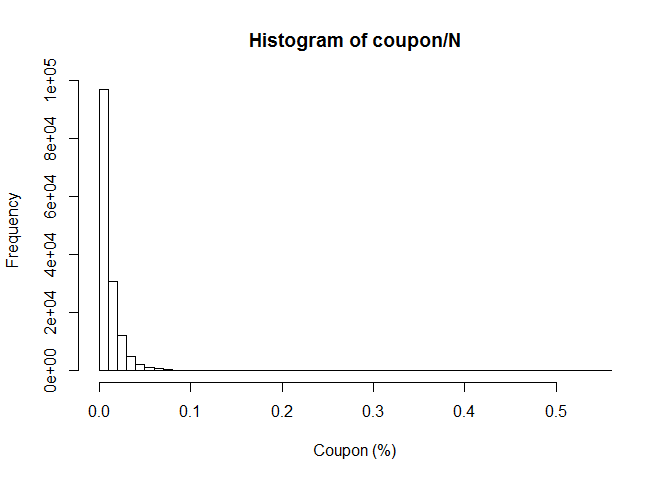

# VolBond
Pieter Pijls  
6 April 2018  

In this study we analyze the risk of a Vol-Bond. 


# 1. Historical Analysis

## Import Data

First, I import the swap rate curves from 2002 to 2018.


```r
# Import Data (swap rates)
setwd("C:/PIETER/INTERNSHIP P&V/Volbond")
set.seed(0387948)
rates <- read.xlsx("./EURIBOR vanilla interest rate swap contract.xlsx",colNames=TRUE,sheet=1)
# create date object
rates$DATE   <- seq(as.Date("2001/1/1"), by = "month", length.out = 206)

rates20 <- as.data.frame(cbind(seq(as.Date("2001/1/1"), by = "month", length.out = 206), rates$`20`))
rates20$V1 <- as.Date(rates20$V1)
```


## Volbond data

We import data for the Volbond. The first column is the date, the second is the CMS rate 20Y in advance. The third column corresponds with the CMS 20Y rate in Arrears. The final column is the coupon which is equal to 3.5*absolute_value(CMS20Y in Advance - CMS20Y in Arrears).

1. An interest rate swap in which the floating rate is set **in advance**, rather than in arrears. That is, the floating rate is **reset at the beginning of the previous period** except for the first period where the floating rate is set at the beginning of the corresponding period as in LIBOR-in-arrears swap. That implies that the floating rate periods, except the first one, are **shifted back by one period**. 

2. An interest rate swap in which the floating rate is set **in arrears**. This means, the floating rate is determined based on the value or level of a specific reference rate at the **end of the reset period**. Once defined, the rate is applied backwardly or retroactively to that period.


```r
# Import data for the Volbond
volbond20 <- rates <- read.xlsx("./Volbond20Y.xlsx",colNames=TRUE,sheet=1) 
volbond20$DATE <- seq(as.Date("2001/1/1"), by = "month", length.out = 206)
volbond20 <- volbond20[-1,]
tail(volbond20)
```

```
##           DATE   Advanced    Arrears      Coupon
## 201 2017-09-01 0.01552997 0.01419720 0.028423968
## 202 2017-10-01 0.01484673 0.01552997 0.017451072
## 203 2017-11-01 0.01469873 0.01484673 0.008950262
## 204 2017-12-01 0.01458644 0.01469873 0.008632111
## 205 2018-01-01 0.01555128 0.01458644 0.005047491
## 206 2018-02-01 0.01605061 0.01555128 0.011644508
```

We plot the evolution of the CMS rate 20y and the Volbond coupon. We observe that the coupon rate spikes when the CMS20Y rate is more volatile. This graph corresponds exactly with the one in Citi Group prospectus. 


```
## Warning: Removed 11 rows containing missing values (geom_path).
```

<!-- -->


We also calculate some summary statistics. The average coupon is equal to 1.8%. 


```r
# summary statistics coupons
summary(volbond20$Coupon)
```

```
##     Min.  1st Qu.   Median     Mean  3rd Qu.     Max.     NA's 
## 0.000369 0.007881 0.015886 0.018151 0.025848 0.065053       11
```

The standard deviation is equal to 1.3%


```r
# standard deviation
sd(volbond20$Coupon[12:nrow(volbond20)])
```

```
## [1] 0.01339778
```

# 2. Risk Neutral Simulations

In this section we simulate a number of risk neutral scenarios to analyze the risk of the VolBond. We calculate the return for the financial product for each scenario. Also we will compare the return from the prospectus with the return under the risk neutral scenarios. 

## Calculations of the different scenarios 

### Calculate the logreturns of the SWAP rate 20Y

First, we calculate the monthly logreturns from the SWAP20Y. Second, we subtract the mean of the logreturns to make the scenarios risk neutral. 


```r
logreturns <- matrix(nrow=nrow(rates20)-1, ncol=1)

# 1. calculate logreturns
for (i in 1:nrow(logreturns)) # loop over scenarios
{
  logreturns[i,1] <- log(rates20[i+1,2])-log(rates20[i,2])
}

# 2. subtract mean to make the returns risk neutral
for (i in 1:nrow(logreturns)) 
{
  logreturns[i,1] <- logreturns[i,1]-mean(logreturns)
}
```

### Sample with replacement

We create 10,000 paths to simulate different scenarios of the evolution of the swap 20Y rate. In every path we sample with replacement from the monthly risk neutral logreturns of the swap rate 20Y.


```r
nsim <- 10000 # number of scenarios
paths <- matrix(nrow=nsim, ncol=15*12) # number of paths x duration of the product

# we use sampling with replacement and import logreturns in the matrix paths
for (i in 1:nsim) # loop over scenarios
{
  paths[i,] <- sample(logreturns, 15*12, replace=TRUE) # sample with replacement from the logreturns
}
```

### Simulate scenarios for the swap rate 20Y

1. We create the variable `initialrate` which is equal to the initial swap rate on 20Y. On 28/2/2018 the rate was equal to 1.61%. 
2. We simulate paths of the swap rate 20Y with the initial rate and the logreturns.


```r
# The swap20Y on 28/2/2018 was 1.61%
initialrate <- 0.0160506054971042 # rate at Y0
rate <- matrix(nrow=nsim, ncol=15*12)
  
for (i in 1:nsim) # loop over different scenarios # take yearly rates
{
  rate[i,1] <- initialrate*(1+paths[i,1]) # rate at first year Y1
  
   for (j in 2:ncol(rate)) # loop over years/time periods (in this case duration of product is 15 years)
  {
    rate[i,j] <- rate[i,j-1]*(1+paths[i,j])
  }
  
}

colnames(rate) <- seq(as.Date("2018/2/1"), by = "month", length.out = 180)
```

For the calculation of the coupons of the VolBond we only need the yearly rates. At this moment we have monthly observations of the swap rate 20Y. In the variable `ratesy` we import only the yearly rates. 


```r
# take yearly rates from the monthly rates
ratesy <- matrix(nrow=nsim, ncol=16)

for (i in 1:nsim) # loop over # take yearly rates
{
  ratesy[i,1] <- initialrate # rate at first year
  
   for (j in 2:ncol(ratesy)) # loop over years
  {
    ratesy[i,j] <- rate[i,(j-1)*12]
  }
  
}
```


We plot the evolution of the swap rate 20Y for 100 different scenarios. 

<!-- -->

### Coupon calculations of the VolBond

We import the yieldcurve which corresponds to the swap yield curve (from 28/2/2018). We will use the yield curve rates to capitalize the coupons to the maturity date (28/2/2033). Remember the maturity we take into account is 15 years.


```
## Warning: Removed 1 rows containing missing values (geom_path).
```

<!-- -->

Here, we calculate the coupons of the Vol-Bond. We assume that we invest an amount $N$ equal to 1 mio EUR. A coupon in a certain year is equal to 3.5*absolute_value(CMS20Y in Advance - CMS20Y in Arrears). Finally, we capitalize the coupons to maturity date. 


```r
N = 1000000 # invest 1 million
coupon <- matrix(nrow = nrow(rate), ncol=ncol(ratesy)-1)

# calculate the coupons every year and capitalize with corresponding swap rate
for (i in 1:nrow(ratesy)) # loop over scenarios
{
  coupon[i,j-1]
  
  for (j in 2:ncol(ratesy)) # loop over years
  {
    coupon[i,j-1] <- 3.5*abs(ratesy[i,j-1]-ratesy[i,j])*as.numeric(yieldcurve[17-j])*N
  }
  
}
```

## Risk Analysis

### Total and yearly return

we calculate the total return and yearly return of the VolBond for all the scenarios. The average yearly return is equal to 0.97%. The minimal yearly return is 0.3% and the maximum yearly return is 6.6%. 


```r
# calculate total return
return <- ( (N + rowSums(coupon)) / N ) - 1
returny <- (1+return)^(1/15) - 1
summary(returny)
```

```
##     Min.  1st Qu.   Median     Mean  3rd Qu.     Max. 
## 0.003143 0.005705 0.007936 0.009756 0.011682 0.066608
```

We create a histogram of the coupon payments in %.


```r
hist(coupon/N, breaks = 50, xlab = "Coupon (%)")
```

<!-- -->

The most coupon have a pay-out below 1%. In the propspectus the average coupon % was around 1.8%. When we use the risk neutral scenarios the average coupon % is only around 1%. The standard deviation is 1.1%.


```r
mean(coupon/N)
```

```
## [1] 0.01077542
```

```r
sd(coupon/N)
```

```
## [1] 0.01451015
```


### Value-at-Risk Indicators 

We analyze the Value-at-Risk indicator for the yearly returns. We calculate the 90%, 95%, 99% and 99.5% VaR indicator of the yearly returns of the VolBond.   


```
##               VaR 90%     VaR 95%     VaR 99%   VaR 99.5%
## Statistics 0.00453463 0.004128823 0.003719937 0.003668341
```

## Conclusion

The average yearly return of the VolBond is around 0.94%. This return is much lower as the average rate of 1.8% included in the prospectus of Citi. The VaR indicators show that the risk exist that the pay-out will be even much less. The probability to have a yearly return lower as 0.45% is 10%. Therefore, the product under the risk neutral scenarios is not so attractive as in the prospectus (which only included one historical path).


# 3. Moody Scenarios

In this section I analyze the scenarios from Moody application. We import 20,000 scenarios from Moody for the evolution of the swap rate 20Y. These scenarios are also used in the ALM model to make inevstment decisions. We create a plot for the evolution of the swap rate for different scenarios. 


```r
SWAP_RATE_20 <- read.xlsx("C:/PIETER/INTERNSHIP P&V/Volbond/SWAP_RATE_20.xlsx",colNames = F, sheet="SWAP_RATE_20") 
SWAP_RATE_20 <- SWAP_RATE_20[,1:15] #take first 15 years
initialrate <- 0.0160506054971042 # rate at Y0
SWAP_RATE_20<- cbind(rep(initialrate,nrow(SWAP_RATE_20)),SWAP_RATE_20)
colnames(SWAP_RATE_20) <- seq(from=0,to=15, by=1)
```


We plot the evolution of the swap rate 20Y for 100 different scenarios from Moody Application. 

<!-- -->

From previous graph we see that there exist a positive drift. In the average scenario of Moody the swap rate 20Y is indeed expected to increase over time (we take the average rate for t=1,2,3,...,15).

<!-- -->

### Coupon calculations of the VolBond

We import the yieldcurve which corresponds to the swap yield curve (from 28/2/2018). We will use the yield curve rates to capitalize the coupons we receive (during the lifetime of the VolBond) to maturity (28/2/2033).


```r
# Import swap yield curve (from 28/2/2018)
yieldcurve <- read.xlsx("C:/PIETER/INTERNSHIP P&V/Volbond/yieldcurve28_2_18.xlsx",colNames = T, sheet=1) 
yieldcurve <- yieldcurve + 1
```


```r
N = 1000000 # invest 1 million
coupon_moody <- matrix(nrow = nrow(SWAP_RATE_20), ncol=ncol(SWAP_RATE_20)-1)

# calculate the coupons every year and capitalize with corresponding swap rate
for (i in 1:nrow(SWAP_RATE_20)) # loop over scenarios
{
  for (j in 2:ncol(SWAP_RATE_20)) # loop over years
  {
    coupon_moody[i,j-1] <- 3.5*abs(SWAP_RATE_20[i,j-1]-SWAP_RATE_20[i,j])*as.numeric(yieldcurve[17-j])*N
  }
  
}
```

### Risk Analysis

Finally, we also make a brief risk analysis of the VolBond under the Moody scenarios. The average yearly return is 1.1%. This is somewhat higher as the average yearly return of 0.97% we had with the risk neutral scenarios.  


```r
# calculate total return
return_moody <- ( (N + rowSums(coupon_moody)) / N ) - 1
returny_moody <- (1+return_moody)^(1/15) - 1
summary(returny_moody)
```

```
##     Min.  1st Qu.   Median     Mean  3rd Qu.     Max. 
## 0.003847 0.009026 0.010579 0.010835 0.012349 0.028433
```


```r
hist(coupon_moody/N, breaks = 50, xlab = "Coupon (%)")
```

<!-- -->

The average coupon % is 1.1%. The standard devation is equal to 0.9%.


```r
mean(coupon_moody/N)
```

```
## [1] 0.01174899
```

```r
sd(coupon_moody/N)
```

```
## [1] 0.009468256
```

### Value-at-Risk Indicators 

We analyze the Value-at-Risk indicator for the yearly returns. We calculate the 90%, 95%, 99% and 99.5% VaR indicator of the yearly returns of the VolBond.  


```
##                VaR 90%     VaR 95%     VaR 99%   VaR 99.5%
## Statistics 0.007816982 0.007158267 0.006067527 0.005692505
```


# Notes

- The only maturity we investigate is 15 years. We could analyze the Vol-Bond for different maturities.
- I did not included the shout option in the analysis. For the shout option we could investigate which is the optimal rate to lock in the coupons to maximize the return. Locking in the rate at the right time can lead to more attractive returns.
- We ignore the default probability of our counterparty. We do not take into account the cost of an insurance against this risk. 
